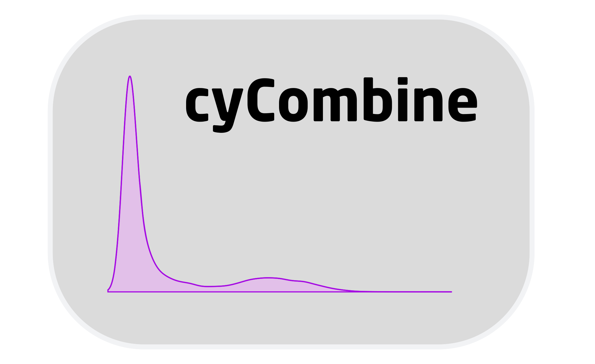

 
 
<table style="width:100%">
<tr>

<td>
[{ width=75% }](cytof_data_scientist.html) Vignette for pure CyTOF example
</td>
    
<td>
[{ width=75% }](cytof_cytometrist.html) Vignette for CITE-seq and CyTOF integration
</td>

</tr>
<tr>

<td>
[{ width=75% }](cytof_data_scientist.html) Vignette for flow cytrometry and CyTOF integration
</td>
    
<td>
[{ width=75% }](cytof_cytometrist.html) Vignette for spectral flow cytrometry and CyTOF integration
</td>

</tr>
</table>
 

