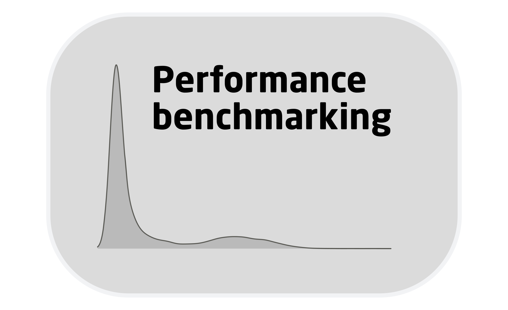
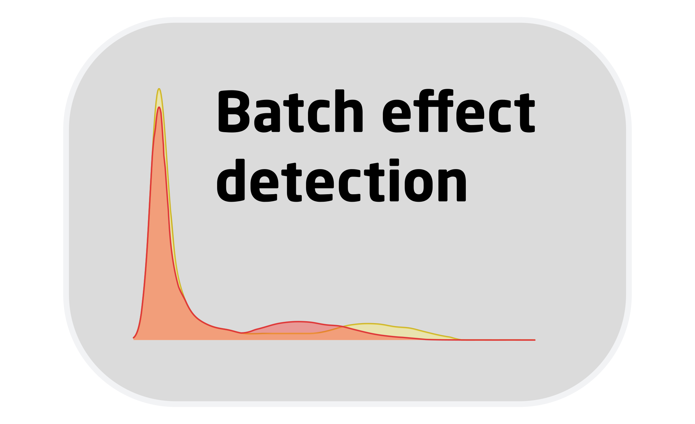
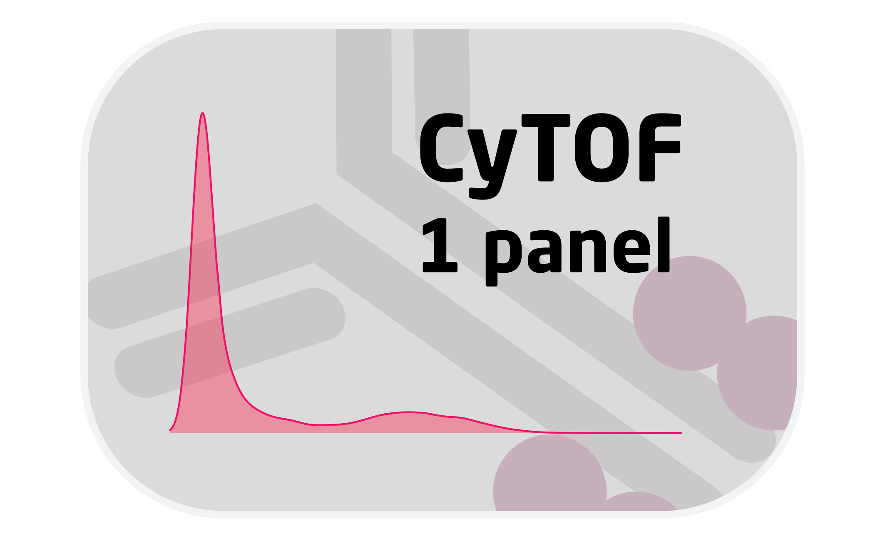
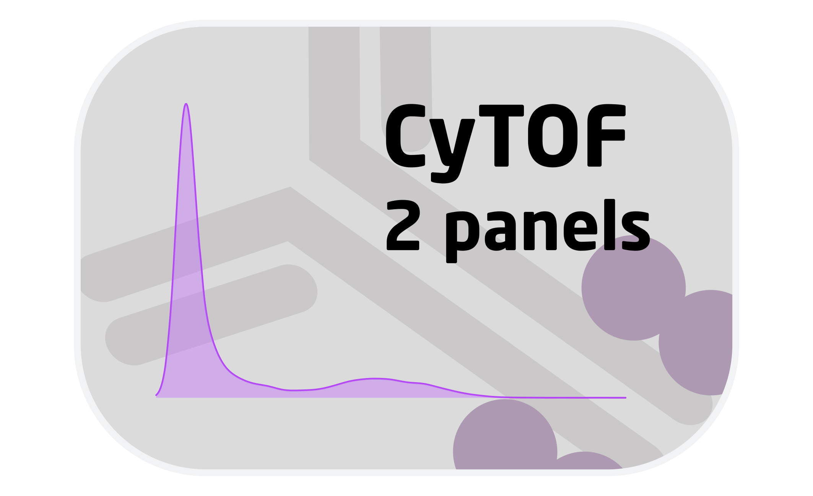
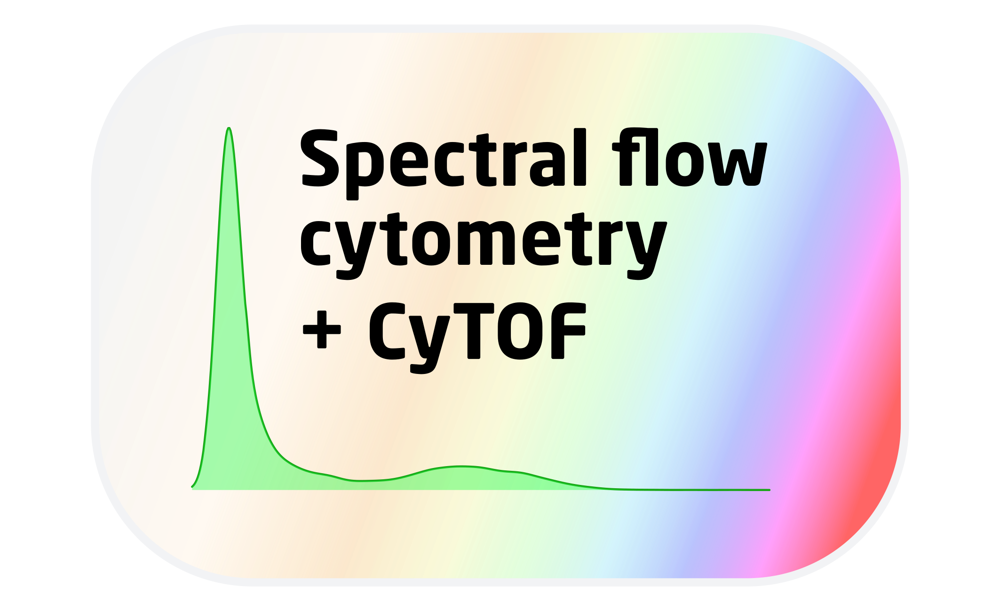

### Robust Integration of Single-Cell Cytometry Datasets | R Package on [GitHub](https://github.com/biosurf/cyCombine)

 
 
<table style="width:100%">
<tr>

<td>
[{ width=75% }](cyCombine_ref_manual.html) Reference manual
</td>

<td>
[{ width=75% }](cyCombine_benchmarking.html) Performance benchmarking
</td>

</tr>
</table>
 

<table style="width:100%">
<tr>

<td>
[{ width=75% }](cyCombine_detect_batch_effects.html) Vignette for batch effect detection
</td>
    
<td>
[{ width=75% }](cyCombine_panel_merging.html) Vignette for panel merging module
</td>

</tr>
</table>
 

<table style="width:100%">
<tr>

<td>
[{ width=75% }](cyCombine_CyTOF_1panel.html) Vignette for pure CyTOF example
</td>
    
<td>
[{ width=75% }](cyCombine_CyTOF_2panels.html) Vignette for two-panel CyTOF example
</td>

</tr>
</table>
 

<table style="width:100%">
<tr>

<td>
[{ width=75% }](cyCombine_Spectralflow_CyTOF.html) Vignette for spectral flow cytrometry and CyTOF integration
</td>

<td>
[{ width=75% }](cyCombine_CITEseq_Spectral_CyTOF.html) Vignette for Spectral flow cytometry, CITE-seq, and CyTOF integration
</td>

</tr>
</table>
<!--   -->

<!-- <table style="width:100%"> -->
<!-- <tr> -->

<!-- <td>
[{ width=75% }](cyCombine/Flow_CyTOF.html) Vignette for flow cytrometry and CyTOF integration
</td> -->

<!-- <td>
[{ width=75% }](cyCombine/CITEseq_CyTOF.html) Vignette for CITE-seq and CyTOF integration
</td> -->

<!-- </tr> -->
<!-- </table> -->