 

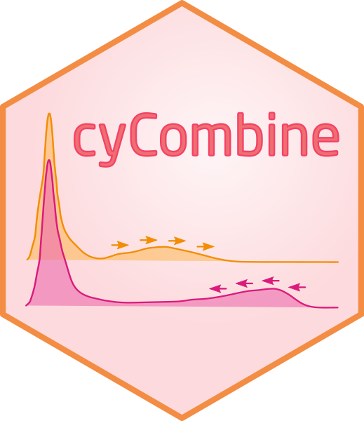

#### cyCombine allows for robust integration of single-cell cytometry datasets within and across technologies

#### R Package on [GitHub](https://github.com/biosurf/cyCombine)

This page contains eight vignettes, which cover a range of different topics related to the use of cyCombine for batch correction and panel merging. Some vignettes also include extended discussions of the approaches. The article introducing cyCombine is published in [Nature Communications](https://doi.org/10.1038/s41467-022-29383-5).

If you have any issues or questions regarding the use of cyCombine, please do not hesitate to raise an issue on GitHub. In this way, others may also benefit from the answers and discussions.

 
 
<table style="width:100%">
<tr>

<td>
[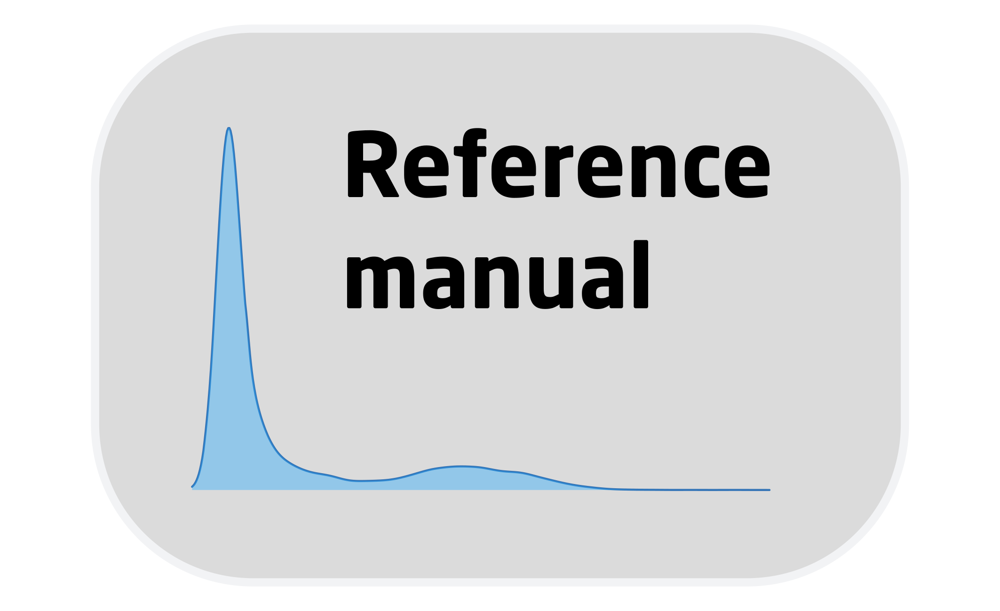{ width=75% }](cyCombine_ref_manual.html) Reference manual
</td>

<td>
[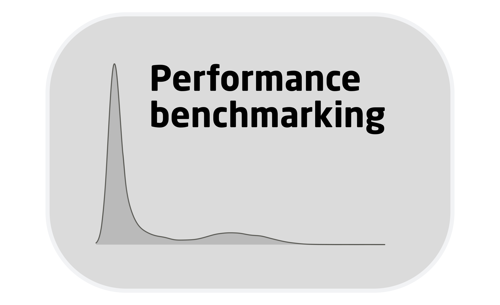{ width=75% }](cyCombine_benchmarking.html) Performance benchmarking
</td>

</tr>
</table>
 

<table style="width:100%">
<tr>

<td>
[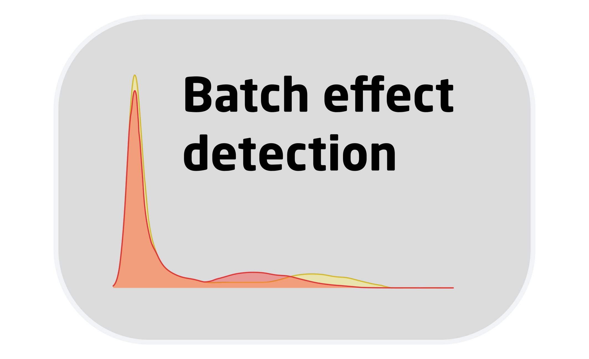{ width=75% }](cyCombine_detect_batch_effects.html) Vignette for batch effect detection
</td>
    
<td>
[{ width=75% }](cyCombine_panel_merging.html) Vignette for panel merging module
</td>

</tr>
</table>
 

<table style="width:100%">
<tr>

<td>
[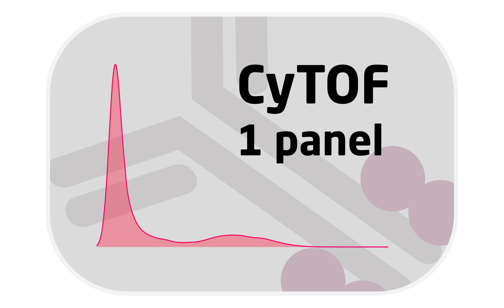{ width=75% }](cyCombine_CyTOF_1panel.html) Vignette for pure CyTOF example
</td>
    
<td>
[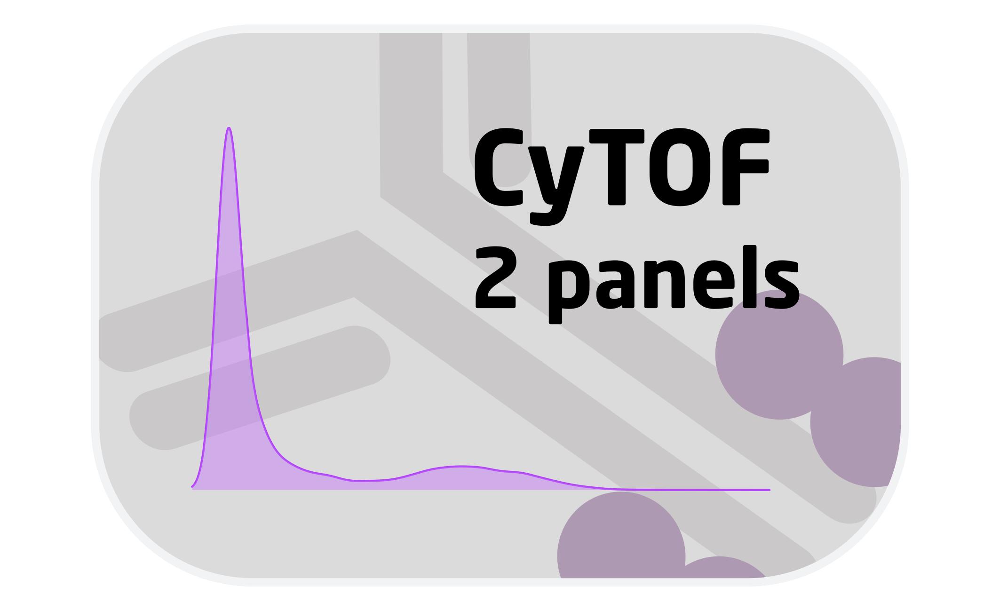{ width=75% }](cyCombine_CyTOF_2panels.html) Vignette for two-panel CyTOF example
</td>

</tr>
</table>
 

<table style="width:100%">
<tr>

<td>
[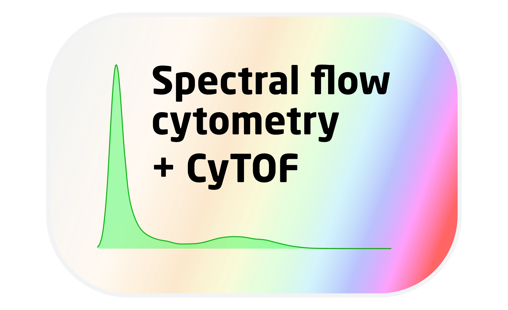{ width=75% }](cyCombine_Spectralflow_CyTOF.html) Vignette for spectral flow cytrometry and CyTOF integration
</td>

<td>
[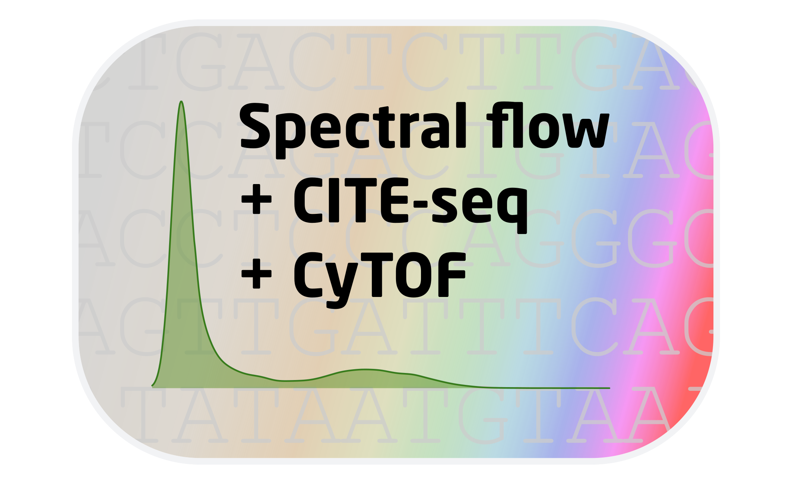{ width=75% }](cyCombine_CITEseq_Spectral_CyTOF.html) Vignette for Spectral flow cytometry, CITE-seq, and CyTOF integration
</td>

</tr>
</table>
 

<table style="width:100%">
<tr>

<td>
[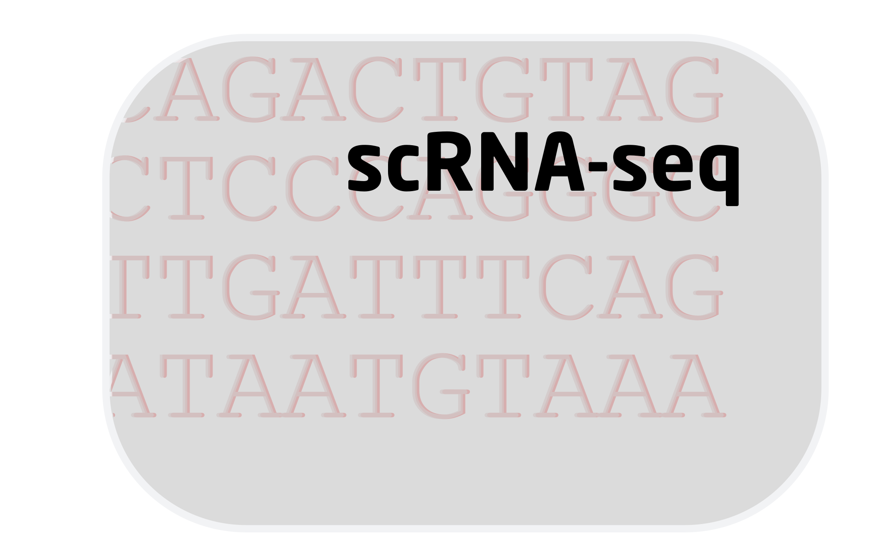{ width=75% }](cyCombine_RNAseq_RNAseq.html) Vignette for scRNA-seq integration
</td>

<td>
[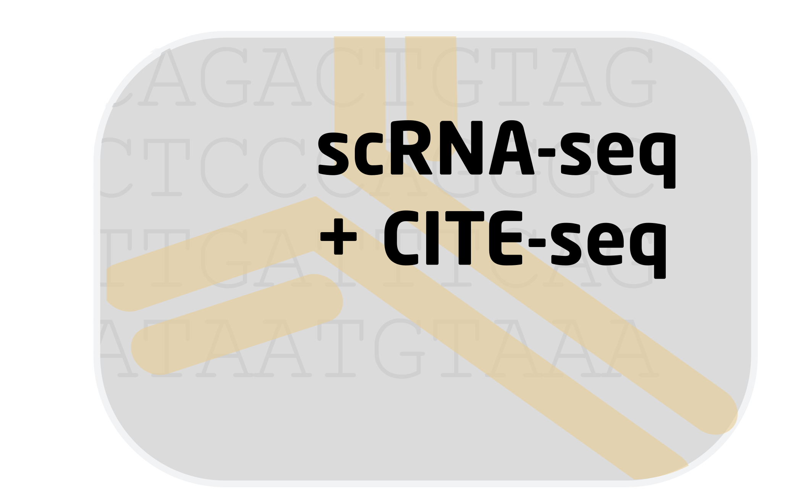{ width=75% }](cyCombine_RNAseq_CITEseq.html) Vignette for scRNA-seq and CITE-seq integration
</td>

</tr>
</table>

<table style="width:100%">
<tr>

<td>
[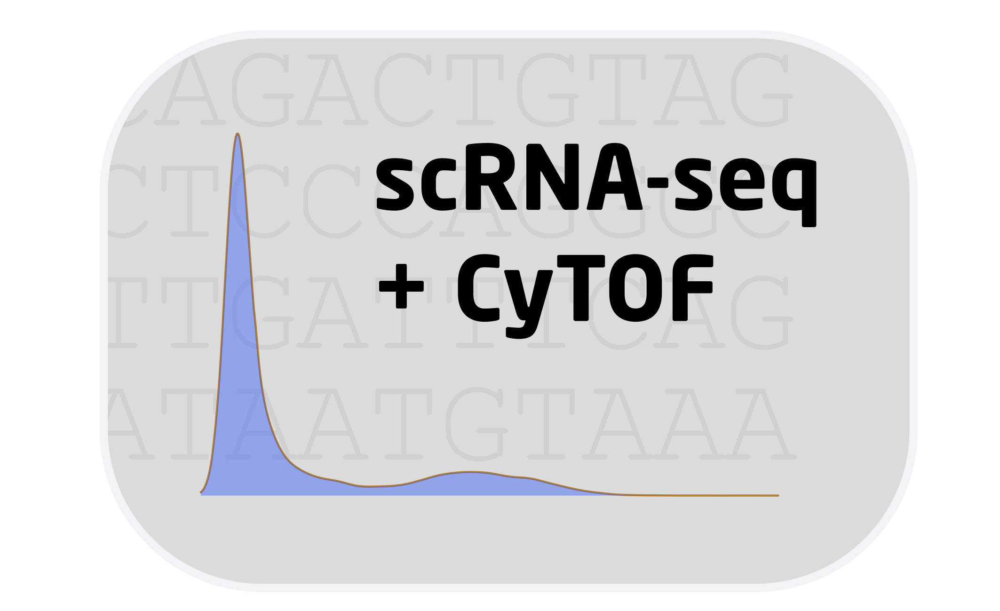{ width=75% }](cyCombine_RNAseq_CyTOF.html) Vignette for scRNA-seq and CyTOF integration
</td>

<td>
[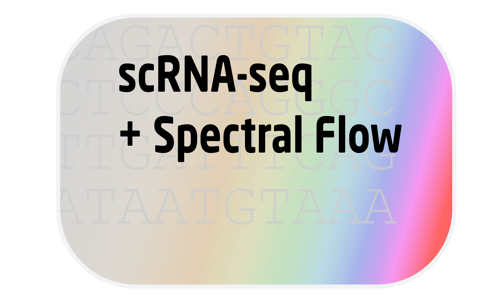{ width=75% }](cyCombine_RNAseq_SFC.html) Vignette for scRNA-seq and Spectral flow cytometry integration
</td>

</tr>
</table>

<table style="width:100%">
<tr>

<td>
[{ width=75% }](cyCombine_cytof_RNA_cocluster.html) Vignette for scRNA-seq and CyTOF split-sample co-cluster analysis
</td>

<td>
[{ width=75% }]()
</td>

</tr>
</table>