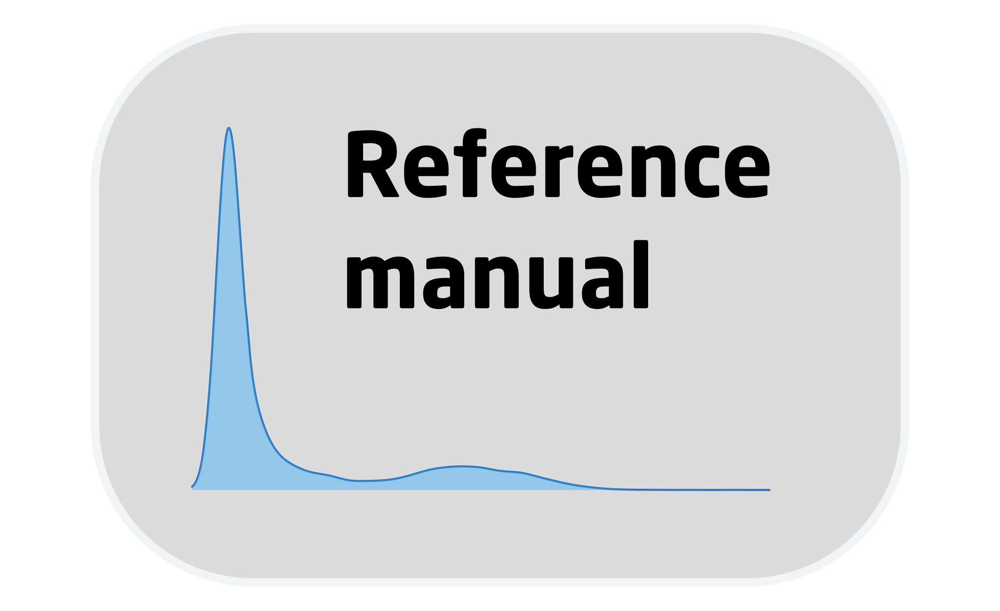
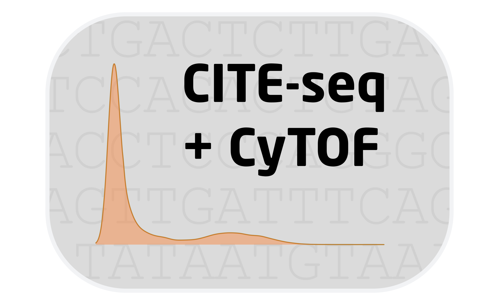

 
 
<table style="width:100%">
<tr>

<td>
[{ width=75% }](https://htmlpreview.github.io/?https://github.com/shdam/cyCombine/blob/master/vignettes/cyCombine.html) Reference manual
</td>
    
<td>
[{ width=75% }](https://htmlpreview.github.io/?https://github.com/shdam/cyCombine/blob/master/vignettes/CyTOF_1panel.html) Vignette for pure CyTOF example
</td>

</tr>
</table>
 

<table style="width:100%">
<tr>

<td>
[{ width=75% }](https://htmlpreview.github.io/?https://github.com/shdam/cyCombine/blob/master/vignettes/CyTOF_2panels.html) Vignette for two-panel CyTOF example
</td>
    
<td>
[{ width=75% }](https://htmlpreview.github.io/?https://github.com/shdam/cyCombine/blob/master/vignettes/CITEseq_CyTOF.html) Vignette for CITE-seq and CyTOF integration
</td>

</tr>
</table>
 

<table style="width:100%">
<tr>

<td>
[{ width=75% }](https://htmlpreview.github.io/?https://github.com/shdam/cyCombine/blob/master/vignettes/Flow_CyTOF.html) Vignette for flow cytrometry and CyTOF integration
</td>
    
<td>
[{ width=75% }](https://htmlpreview.github.io/?https://github.com/shdam/cyCombine/blob/master/vignettes/Spectralflow_CyTOF.html) Vignette for spectral flow cytrometry and CyTOF integration
</td>

</tr>
</table>
