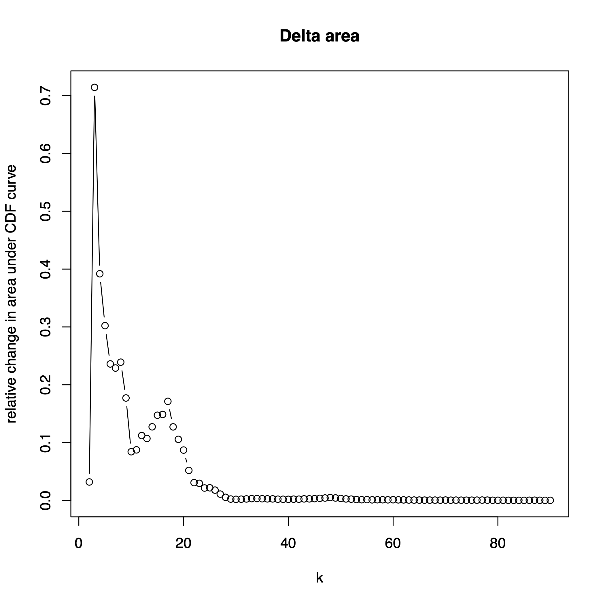

<style type="text/css">

h1.title {
  color: #004d66;
}
h4.author {
  font-style: italic;
  font-size: 18px;
  color: #008cba;
}
h4.date {
  font-style: italic;
  font-size: 16px;
  color: #008cba;
}
h1 { /* Header 1 */
  color: #004d66;
  font-size: 28px;
}
h2 { /* Header 2 */
  color: #004d66;
  font-size: 22px;
}
h3 { /* Header 3 */
  color: #004d66;
  font-size: 16px;
}
pre code, pre, code {
  white-space: pre !important;
  overflow-x: scroll !important;
  word-break: keep-all !important;
  word-wrap: initial !important;
}
</style>


<br>

This vignette will demonstrate the batch correction of a CyTOF set consisting of 128 samples in seven batches using cyCombine. It will also include a small discussion regarding the grid size during batch correction.


```{r setup, include = FALSE}
knitr::opts_chunk$set(
  strip.white = T, comment = ""
)

knitr::opts_knit$set(root.dir = '/home/projects/dp_immunoth/people/s134891/cycombine/DFCI/Mike_process')

```


<br>
This is data from a study of CLL patients and healthy donors at the Dana-Farber Cancer Institute (DFCI). The protein expression was quantified using mass cytometry for 128 samples (20 healthy donors). The data was run in seven batches and used a panel measuring expression of 36 proteins.


<br>

# Pre-processing data

We start by loading some packages.

```{r libraries, results = 'hide', warning=FALSE, message=FALSE}
library(cyCombine)
library(tidyverse)

```


<br>

We are now ready to load the CyTOF data. We have set up a panel file in csv format, so the correct information is extractable from there. Let us have a look at the contents:

```{r loading data 1, warning=FALSE, message=FALSE}
# Directory with raw .fcs files
data_dir <- "Panel1_renamed"

# Panel and reading data
panel <- read_csv("panel1.csv")
panel

```

<br>

We then progress with reading the CyTOF dataset and converting it to a tibble format, which is easy to process. We use cofactor = 5 (default) in this case.


```{r loading data 2}
# Extracting the markers
markers <- panel %>%
  filter(Type != "none") %>%
  pull(Marker) %>%
  str_remove_all("[ _-]")

# Preparing the expression data
dfci <- prepare_data(data_dir = data_dir,
                     metadata = "metadata.csv",
                     filename_col = "FCS_name",
                     batch_ids = "Batch",
                     condition = "Set",
                     markers = markers,
                     derand = TRUE,
                     down_sample = FALSE)

```

<br>

# Checking for batch effects
Now, let us use a cyCombine function to check if there are any batch effects to correct for at all... cyCombine will run on data even with no real batch effects, and in those cases, the batch correction should have minimal effect. However, there is no reason to run the algorithm, if we have no batch effects in the data.

```{r detect batch effects}
# We use the quicker version of the function. It generates three types of plots that may be useful in surveying a dataset for batch effects. Here, we also downsample since all cells are typically not needed to see batch effects.
detect_batch_effect_express(dfci, downsample = 10000, out_dir = 'batch_effect_check')

```
<br>

In the printed output, we already get some pointers to potential problems with batch effects. But let us look at each of these plots for this dataset. First we have the EMD per marker-plot, which shows the mean Earth Mover's Distance for all pairwise batch-to-batch comparisons. The distribution of each marker is considered globally for each comparison. The error bars represent the standard deviation. In this dataset, we observe a relatively high mean EMD for XCL1, and further this marker has a large standard deviation. This indicates that there may be a batch effect to consider in this marker - perhaps it is significantly over- or under-stained in one or more batches compared to the rest? According to the text, batch 1 is the problem. 


<br>

To figure out if that is really the case, we can look at the second generated plot. This is the distribution of each marker in each batch. Quantiles are shown as vertical bars. 

When looking at XCL1, we clearly observe the batch effect indicated before - batch 1 looks very different from the rest! Also, have a look at TBet. This marker had the second-highest mean EMD above - and here, the distributions for batches 6 and 7 look different than the rest.  


<br>

Now for the final plot - a multidimensional scaling (MDS) plot. This form of dimensionality reduction can be used to detect outlier batches (or samples) based on the median marker expression per *sample*. Each dot corresponds to a sample - and the colors represent batches. If there are no batch effects, the pattern would be random - and though it can be hard to judge, here we will notice how the red batch 1 samples almost exclusively appear in the top part of the plot.
In other words, it looks a bit like batch effects!


<br>

We could dwell more at this, and we could also use the full `detect_batch_effect()` function of cyCombine to look at this more carefully. However, for now we are convinced that batch effects exist and we will correct them with cyCombine.


<br>

# Batch correction

Time to perform the batch correction:

```{r batch correction, message=FALSE, warning=FALSE, error=FALSE, results='hide'}
# Run batch correction
corrected <- dfci %>%
  batch_correct(covar = "condition",
                xdim = 8,
                ydim = 8,
                norm_method = 'scale',
                markers = markers)

```

<br>

# Evaluating performance

We start with some quantitative measurements of the correction performance.

```{r emd and mad, fig.height=5, fig.width=10, message=FALSE, warning=FALSE, error=FALSE, results='hide'}
# Cluster corrected data
labels <- corrected %>%
          cyCombine::create_som(rlen = 10,
                                xdim = 8,
                                ydim = 8,
                                markers = markers)
# Add labels
corrected <- corrected %>%
  dplyr::mutate(som = labels)

# Set column for evaluation of EMD (per-cluster)
celltype_col <- "som"

# Transfer labels to uncorrected data
dfci <- corrected %>%
  dplyr::select(id, all_of(celltype_col)) %>%
  dplyr::left_join(dfci, by = "id")

# Evaluation using EMD
emd_val <- dfci %>%
      cyCombine::evaluate_emd(corrected,
                              binSize = 0.1,
                              markers = markers,
                              cell_col = celltype_col)

# Show plots
cowplot::plot_grid(emd_val$violin, emd_val$scatterplot)


# Evaluation using MAD
mad_val <- dfci %>%
      cyCombine::evaluate_mad(corrected,
                              filter_limit = NULL,
                              markers = markers,
                              cell_col = celltype_col)

```

```{r mad score print}
cat('The MAD score is:', mad_val$score, '\n')

```


Let us also look at some plots to visualize the correction. First, the marker distributions before and after:

```{r density plot, message=FALSE, fig.height=22, fig.width=12}
plot_density(dfci, corrected, ncol = 4)

```

<br>

Finally, some UMAPs to visualize the correction. We will downsample to 2,000 cells from each sample so it is easier to see what is going on.

```{r umaps, fig.height=8, fig.width=16}
inds <- split(1:length(dfci$batch), dfci$batch)
sample <- unlist(lapply(inds, sample, 2000))

plot1 <- plot_dimred(dfci[sample,], name = 'Uncorrected', type = 'umap')
plot2 <- plot_dimred(corrected[sample,], name = 'Corrected', type = 'umap')

cowplot::plot_grid(plot1, plot2)

```


<br>

Based on the marker distributions after correction and the UMAPs, it looks like the batch effects are eliminated. We can now address our biological questions. However, we have simply used the default grid size of 8x8 in this example. The clustering with the self-organizing map is used to group similar cells, for which batch correction can be performed properly for a more homogeneous set of cells. While 64 clusters should be enough for most PBMC analyses, the default grid size may not always be appropriate. Rare subsets can be missed when using smaller grids, depending on their specific expression pattern and how distinct the rare cell type is from the other cells in the data. This problem is not unique to cyCombime, but rather a function of the SOM itself (which also happens to be the foundation of the widely FlowSOM clustering approach). 

<br>

If greater heterogeneity is anticipated in a dataset, we recommend increasing the grid size. Generally, one should aim for a grid size which can capture the variance of the data, but it is not a goal in itself to strongly over-cluster as this will yield smaller sets of cells for batch correction, rendering the correction less robust. As in any analysis involving a clustering step, we would recommend initial explorations of all datasets to establish an idea of the heterogeneity in the data, and then set the grid size accordingly when running cyCombine.

<br>

One way to get an idea about the heterogeneity in a dataset could be to run a clustering tool which automatically determines the number of clusters (e.g. Phenograph) using all the markers and letting the number of clusters obtained be a guide. Otherwise one could use ConsensusClusterPlus (the meta-clustering engine of FlowSOM) with the elbow criterion as discussed [here](https://www.bioconductor.org/packages/release/workflows/vignettes/cytofWorkflow/inst/doc/cytofWorkflow.html#reducing-the-number-of-clusters-in-consensusclusterplus). However, because of the batch effects, it can be problematic to cluster across batches on the uncorrected dataset (the investigation of clusters should take place before applying cyCombine), as it can lead to over-estimation of the cluster count. In this example, we normalize the data using scaling (per-batch) before doing clustering (analogously to the cyCombine workflow). We will select a 10x10 grid for the initial clustering and then use ConsensusClusterPlus with up to 90 (maximum allowed) clusters.

```{r cluster and elbow, results = 'hide', warning=FALSE, message=FALSE}
# Scaling and clustering using a SOM
seed = 9735
som_ <- dfci %>% 
  cyCombine::normalize(markers = markers, norm_method = 'scale') %>% 
  dplyr::select(all_of(markers)) %>% as.matrix() %>% 
    kohonen::som(grid = kohonen::somgrid(xdim = 10, ydim = 10), 
      rlen = 10, dist.fcts = "euclidean")

# Extracting the SOM codes (the SOM grid placement for each of the 100 nodes)
codes <- som_$codes[[1]]

# Making a meta-clustering and plotting the delta area plot
library(ConsensusClusterPlus)
mc <- ConsensusClusterPlus(t(codes), maxK = 90, reps = 100,
                           pItem = 0.9, pFeature = 1, plot = 'png', title = 'batch_effect_check',
                           clusterAlg = "hc", innerLinkage = "average", finalLinkage = "average",
                           distance = "euclidean", seed = seed)

```



<br> 

The delta area plot shows the relative change in cluster stability (area under CDF curve), when adding one extra meta-cluster. The goal is to choose a *k* where there is no significant increase. In this case, that occurs around *k* = 25 or *k* = 30 depending on how strict the requirement is. In any case, this shows that usign 64 SOM nodes should capture the total data variance for batch correction.


<!-- One example could be to cluster the dataset. Here, we will display the results of Phenograph clustering. Actually, I will compare Phenograph run for all seven batches *with* and *without* batch correction using the same set of markers. -->

<!-- <br> -->

<!-- ```{r phenograph, results = 'hide', warning=FALSE, message=FALSE} -->
<!-- # Define the markers to use for clustering -->
<!-- cl_markers <- c('CD3', 'CD45RA', 'CD14', 'CD45RO', 'CD152', 'CD33', 'CD4', 'CD8', 'CD197', 'CD56', 'FoxP3', 'CD25') -->

<!-- # Run Phenograph (slow step ~4.5 hours for each dataset) -->
<!-- pheno_uncor <- Rphenograph(data = dfci[,cl_markers]) -->
<!-- pheno_cor <- Rphenograph(data = corrected[,cl_markers]) -->
<!-- ``` -->

<!-- ```{r phenograph n_cl} -->
<!-- cat(paste0('According to Phenograph, there are ', length(unique(pheno_uncor[[2]]$membership)), ' clusters in the combined, uncorrected dataset.\n')) -->

<!-- cat(paste0('According to Phenograph, there are ', length(unique(pheno_cor[[2]]$membership)), ' clusters in the combined, batch corrected dataset.\n')) -->
<!-- ``` -->

<!-- The fact that fewer clusters are found after batch correction illustrates that we have a more well-combined dataset, in which the chance of having smaller batch-specific clusters is minimized. -->

<!-- Now, one would normally proceed to labeling these clusters and looking for differential abundance between experimental conditions and so on. We will leave it here for now. -->