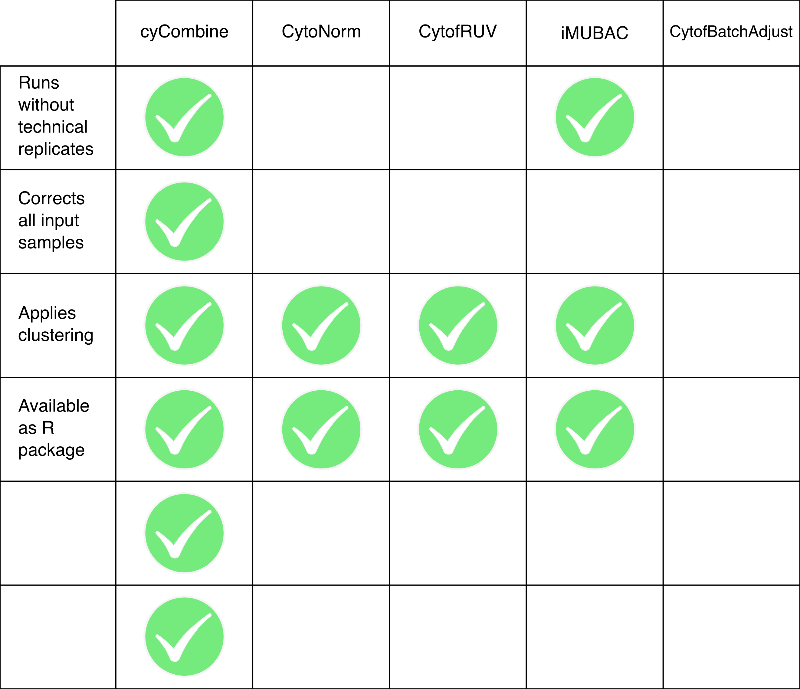

<style type="text/css">

h1.title {
  color: #004d66;
}
h4.author {
  font-style: italic;
  font-size: 18px;
  color: #008cba;
}
h4.date {
  font-style: italic;
  font-size: 16px;
  color: #008cba;
}
h1 { /* Header 1 */
  color: #004d66;
  font-size: 28px;
}
h2 { /* Header 2 */
  color: #004d66;
  font-size: 22px;
}
h3 { /* Header 3 */
  color: #004d66;
  font-size: 16px;
}
pre code, pre, code {
  white-space: pre !important;
  overflow-x: scroll !important;
  word-break: keep-all !important;
  word-wrap: initial !important;
}
</style>


<br>

This vignette will demonstrate the performance benchmarking applied in the cyCombine article. 


```{r setup harmony, include = FALSE}
# Settings and package loading for all tools
options(java.parameters="-Xmx60G")  ## allow JAVA to use large memory space
library(harmony)
library(tidyverse)
library(data.table)
library(SingleCellExperiment)
library(iMUBAC)

library(cyCombine)

library(CytoNorm)

library(CytofRUV)
library(CATALYST)
library(flowCore)

```


<br>


# Performance metrics - discussion
In the cyCombine article, the Earth Mover's Distance (EMD) reduction is used as the most important performance metric. The EMD reduction relies on the EMD, which is a distance measure for probability distributions. As with most metrics, the EMD reduction has both advantages and disadvantages. First, the formula:

$$EMD_{reduction} = \frac{\sum\limits_{i=1}^{n}(EMD_{before_i} - EMD_{after_i})}{\sum\limits_{i=1}^{n}EMD_{before_i}}$$
Where *n* is the total number of comparisons (number of SOM nodes times the number of markers times the number of pairwise batch comparisons).

As mentioned in the article, the EMD was used to compare the distribution of each marker within SOM nodes across batches. The metric relies on binning of values in bins at 0.1-increments (default) and computes the EMD for every marker for each pairwise batch comparison. This means that if you have seven batches and 15 markers, you have 21 (7-choose-2) * 15 = 315 EMD calculations *per SOM node*. Now, this notion of calculation per-SOM node is one to discuss: If you calculate the EMD globally, across all cells, you essentially assume that the distribution of cell types is also the same between batches - i.e. that you have an equal fraction of CD8+ cells in each batch. This may not hold true. Instead, when clustering (in this case by the use of a SOM) is applied, you avoid such assumptions. We use a relatively large SOM of 8x8 = 64 nodes, so we are likely to obtain over-clustering of the dataset in question. This is done to compare only highly similar cells when the EMDs are calculated. This holds a potential for problems, which we will return to in the next section.

<br> 

In practice, we perform the SOM clustering on the *corrected* data, no matter the batch correction tool. The idea behind this is that batch effects should be removed after correction allowing for more correct clustering. The assigned SOM node for each cell is then transferred from the corrected data to the *uncorrected* data allowing for direct comparison of single cells before and after batch correction. 

This however has some implications for the analysis, including the fact that the EMD values for an *uncorrected* data set will vary between batch correction methods. Depending on the correction cells may get clustered differently, leading to different EMD computations in uncorrected data.

<br> 

Why do we do this? Because the clustering of uncorrected data might not be 'correct' - and while we make the assumption that scaling/ranking is necessary to align populations, not all the tested tools apply such measures.

Another approach could be to use pre-defined cell labels for each cell instead of a SOM clustering and then quantify the batch effect with EMD calculations within these cell groups. This strongly relies on the user to come up with a robust labeling before the testing and can also be considered biased. However, once labels are in place, the solution is quick to implement and also lowers the computational run time.

<br> 

However, there are some more general caveats to using the EMD reduction term, which we should also touch upon.

<br>

## EMD caveats
We will split this discussion into three parts: 

#. Cluster-wise vs. global EMD
#. Small batch effects => low reduction
#. Systemic information loss => high reduction


<br>

Regarding the use of cluster-wise vs. global EMD, we have already discussed the issues that prevent the use of global EMD calculations. However, there may be cases where cluster-wise calculations provide overly good results. This can happen if we, *after* correction, still have a very batch-driven SOM-clustering. That would mean that each cluster mostly contains cells from single batch, and the EMD calculations between batches will be based on only few cells from some batches. 

<br>

For small batch effects, one may achieve very small EMD reductions since this is a *relative* measure comparing batch effects before and after correction. Essentially, a tool should not correct a dataset with no batch effects, so a low EMD reduction can be considered a mark of quality - but at first glance it may seem like a tool is not performing well. When comparing corrections for the same dataset for multiple tools, this is not a large problem. But in use-cases, the EMD reduction should not stand alone: One should always inspect some plots to judge whether A) batch correction is necessary (see our [detection module](https://biosurf.org/cyCombine_detect_batch_effects.html)) and B) if batch correction worked.

<br>

The last case is a tricky one, which we demonstrate using a small synthetic example. Imagine that you perform batch correction using two different tools. We consider only a single marker - 'exp'. We look at it before correction and see that the positive peak is misaligned:

```{r systemic information loss 1}
# Generate dataset 2
df1 <- data.frame('exp' = c(c(rnorm(n = 3750, mean = 1, sd = 0.5), rnorm(n = 1250, mean = 7, sd = 1)),
                            c(rnorm(n = 3500, mean = 1, sd = 0.5), rnorm(n = 1500, mean = 5, sd = 1))),
                  'batch' = rep(c("1","2"), each = 5000),
                  'label' = 1)

library(ggplot2)
ggplot(df1, aes(x = exp)) +
  geom_density(aes(color = batch, fill = batch), alpha = 0.3) + 
  coord_cartesian(xlim = c(0,10)) + ggtitle('Uncorrected')

```

<br>
You then decide to perform batch correction using two different tools. They produce the following two plots after correction:

```{r systemic information loss 2}
# Generate dataset 2
df2 <- data.frame('exp' = c(c(rnorm(n = 3750, mean = 1, sd = 0.5), rnorm(n = 1250, mean = 6, sd = 1)),
                            c(rnorm(n = 3500, mean = 1, sd = 0.5), rnorm(n = 1500, mean = 6, sd = 1))),
                  'batch' = rep(c("1","2"), each = 5000),
                  'label' = 1)

ggplot(df2, aes(x = exp)) +
  geom_density(aes(color = batch, fill = batch), alpha = 0.3) + 
  coord_cartesian(xlim = c(0,10)) + ggtitle('Tool 1')

emd_1 <- cyCombine::compute_emd(df2, markers = 'exp', cell_col = 'label')[[1]]$exp[1,2]


# Generate dataset 2
df3 <- data.frame('exp' = c(rnorm(n = 5000, mean = 1, sd = 0.5),
                            rnorm(n = 5000, mean = 1, sd = 0.5)),
                  'batch' = rep(c("1","2"), each = 5000),
                  'label' = 1)

ggplot(df3, aes(x = exp)) +
  geom_density(aes(color = batch, fill = batch), alpha = 0.3) + 
  coord_cartesian(xlim = c(0,10)) + ggtitle('Tool 2')

emd_2 <- cyCombine::compute_emd(df3, markers = 'exp', cell_col = 'label')[[1]]$exp[1,2]


# Print EMDs
cat('The EMD for tool 1 is', round(emd_1, 2), '\n')
cat('The EMD for tool 2 is', round(emd_2, 2), '\n')

```
<br>

You calculate the the EMD between the two batches for both tools. Tool 1 yields a much larger EMD - but looking at the plot for tool 2, it is clear that this is only because of systemic information loss. Tool 2 has removed all the potentially interesting variation for the marker in question. This is yet another reason to always inspect some plots when performing batch correction. Because of this, we introduced a second performance metric, the Median Absolute Deviation (MAD) score. This score is meant to detect potential systemic information loss by quantifying the variability of each marker in the dataset before and after correction. In practice, it is calculated very similarly to the EMD reduction: The MAD is calculated for the dataset after performing a SOM-based clustering, and is calculated per-cluster, per-marker, per-batch. So, the MAD is calculated per-batch, whereas the EMD calculations are performed for each pairwise batch-batch comparison. This means that the MAD score quantifies intra-batch effects of the correction and the EMD reduction quantifies inter-batch effects. After calculating the MAD per-cluster, per-marker, per-batch for both the corrected and uncorrected datasets, the MAD score is calculated as the median of the absolute difference in MAD per value:

<br>

$$MAD_{score} = \mathrm{median}_{i=1}^n (|MAD_{before_i} - MAD_{after_i}|)$$
Where *n* is the total number of comparisons (number of SOM nodes times the number of markers times the number of batches). 

<br>
Because the MAD score quantifies the information 'loss', the ideal tool has a *small* MAD score.

<br>

In the simple example, the MAD score calculations for tools 1 and 2 would be:

```{r mad calculation}
mad_bf <- cyCombine::compute_mad(df1, markers = 'exp', cell_col = 'label') %>% unlist()
mad_1 <- cyCombine::compute_mad(df2, markers = 'exp', cell_col = 'label') %>% unlist()
mad_2 <- cyCombine::compute_mad(df3, markers = 'exp', cell_col = 'label') %>% unlist()

# Print MADs
cat('The MADs for the unccorrected set are', paste(round(mad_bf, 2), collapse = ' and '), '\n')
cat('The MADs for tool 1 are', paste(round(mad_1, 2), collapse = ' and '), '\n')
cat('The MADs for tool 2 are', paste(round(mad_2, 2), collapse = ' and '), '\n\n')

# Calculate MAD scores
cat('The MAD score for tool 1 is', round(median(abs(mad_bf - mad_1)), 2), '\n')
cat('The MAD score for tool 2 is', round(median(abs(mad_bf - mad_2)), 2), '\n')

```

<br> 

Here, it is clearly seen that the MAD score is efficient in detecting the systemic information loss of tool 2, which has a much higher MAD score. Tool 1 has a MAD score very close to 0, which fits our idea that this tool does not remove biological variation, but only corrects batch effects. For calculation of the MAD score in a real dataset, we recommend using the `evaluate_mad` function.


<br>

With the EMD reduction and the MAD score, we have provided two quantitative measures for batch effect and information removal. They each hold some strong positive qualities for this purpose and could prove useful for many future studies on the topic. We would also like to mention the approach presented in [BatchBench](https://doi.org/10.1093/nar/gkab004), which relies on entropy metrics. This is a strong alternative to the EMD/MAD approaches presented here.

<br><br>


# Different tools - discussion
We compare the performance of cyCombine to that of four other tools, [CytoNorm](https://doi.org/10.1002/cyto.a.23904), [CytofRUV](https://doi.org/10.7554/eLife.59630), [iMUBAC](https://doi.org/10.4049/jimmunol.2000854), and [CytofBatchAdjust](https://doi.org/10.3389/fimmu.2019.02367). 

All tools are written in R, and with the exception of CytofBatchAdjust, they are published as installable packages. CytofBatchAdjust has to be loaded from a script. 

<br>

Three of the tools, CytoNorm, CytofRUV, and CytofBatchAdjust all require technical replicates to perform batch correction. CytoNorm only performs correction of the non-replicated samples, and as such assumes that the technical replicates are only included for technical purposes. iMUBAC conversely excludes patients samples from the actual correction, and instead has a scheme for projecting the patient samples into the corrected 'healthy' space post-correction. iMUBAC also downsamples in the batch correction step as it would otherwise be too computationally heavy to run. Similarly, CytofRUV is relatively memory-heavy, but it does not require downsampling for any of our tested datasets. 

<br>

These three tools all rely on clustering of the data before performing cluster-wise corrections. This is not the case for CytofBatchAdjust, which performs global corrections. This means that CytofBatchAdjust does not account for the fact that batch effects might affect different cell types in different ways. 


<!-- <br> -->

<!-- An overview of the different tools is presented below: -->

<!--  -->

<br><br>


# Benchmarking: CytoNorm data

```{r setup, include = FALSE}
knitr::opts_chunk$set(
  strip.white = T, comment = ""
)

knitr::opts_knit$set(root.dir = '/home/projects/dp_immunoth/people/s153398/cyCombine/')

```


## Loading data

```{r packages, results = 'hide', warning=FALSE, message=FALSE, eval=FALSE}
# Settings and package loading for all tools
options(java.parameters="-Xmx60G")  ## allow JAVA to use large memory space
library(harmony)
library(tidyverse)
library(data.table)
library(SingleCellExperiment)
library(iMUBAC)

library(cyCombine)

library(CytoNorm)

library(CytofRUV)
library(CATALYST)
library(flowCore)

```


```{r loading data, results = 'hide', warning=FALSE, message=FALSE}
# Specify data location
data_dir <- "cytonorm/data"

# Define panel and protein markers
panel <- file.path(data_dir, "panel_cytonorm.xlsx") %>% 
  readxl::read_xlsx() %>% 
  dplyr::rename(channel = fcs_colname) %>% 
  dplyr::filter(marker_class != "none")

markers <- panel %>%
  dplyr::pull(antigen) %>% 
  stringr::str_remove_all("^\\d+[A-Za-z]+_") %>%
  stringr::str_remove_all("[ _-]")

# Compile fcs files and preprocess
uncorrected <- prepare_data(data_dir = data_dir,
                            metadata = "cytonorm_cohort.xlsx",
                            filename_col = "FCS_name",
                            batch_ids = "Batch",
                            condition = "Set",
                            sample_ids = "Sample ID",
                            markers = markers,
                            down_sample = FALSE,
                            cofactor = 5,
                            derand = TRUE)

# Subsetting to singlet cells - commented out, as they don't do it in the original paper
# uncorrected <- uncorrected %>% dplyr::filter(singlet)

# Loading meta data
meta <- readxl::read_xlsx(paste0(data_dir, "/cytonorm_cohort.xlsx"))

# Set column for evaluation of EMD (per-cluster)
celltype_col <- "som"

# Set up variable for saving results
results <- list()
```


<br><br>


## cyCombine

```{r cyCombine 1, fig.height=5, fig.width=10, message=FALSE, warning=FALSE, error=FALSE, results='hide'}
# Run batch correction
corrected <- uncorrected %>%
  batch_correct(markers = markers,
                rlen = 10,
                norm_method = 'scale',
                covar = 'condition')

# Cluster on corrected data
labels <- corrected %>%
          cyCombine::create_som(rlen = 10,
                                xdim = 8,
                                ydim = 8,
                                markers = markers)
# Add labels
corrected <- corrected %>%
  dplyr::mutate(som = labels)

# Transfer labels to uncorrected data
uncorrected <- corrected %>%
  dplyr::select(id, all_of(celltype_col)) %>%
  dplyr::left_join(uncorrected, by = "id")

# Evaluation using EMD
emd_val <- uncorrected %>%
      cyCombine::evaluate_emd(corrected,
                              binSize = 0.1,
                              markers = markers,
                              cell_col = celltype_col)

# Show plots
cowplot::plot_grid(emd_val$violin, emd_val$scatterplot)


# Evaluation using MAD
mad_val <- uncorrected %>%
      cyCombine::evaluate_mad(corrected,
                              filter_limit = NULL,
                              markers = markers,
                              cell_col = celltype_col)

# Save results
results[['cyCombine']] <- list('uncorrected' = uncorrected, 'corrected' = corrected)

```

```{r cyCombine 2, message=FALSE, warning=FALSE, error=FALSE}
cat('The MAD score is:', mad_val$score, '\n')
```


<br><br>

## CytoNorm

```{r change dir 1, include = FALSE}
knitr::opts_knit$set(root.dir = '/home/projects/dp_immunoth/people/s134891/cycombine/cytonorm_data/')
data_dir <- '/home/projects/dp_immunoth/people/s153398/cyCombine/cytonorm/data'
```


```{r CytoNorm 1, fig.height=5, fig.width=10, message=FALSE, warning=FALSE, error=FALSE, results='hide'}
# Define the samples to correct and the reference samples
train_data <- meta %>% 
  dplyr::filter(`Sample ID` %>% startsWith("Control1"))
val_data <- meta %>% 
  dplyr::filter(`Sample ID` %>% startsWith("Control2"))


# Code for setting up the run - taken from the CytoNorm Github
transformList <- flowCore::transformList(panel$channel,
                                         cytofTransform)

transformList.reverse <- flowCore::transformList(panel$channel,
                                                 cytofTransform.reverse)


# Building the model for correction using Control 1
model <- CytoNorm.train(files = paste0(data_dir, "/", train_data$FCS_name, ".fcs"),
                        labels = train_data$Batch,
                        channels = panel$channel,
                        transformList = transformList,
                        FlowSOM.params = list(nCells = 2842208, # All cells in the Control1 samples
                                              xdim = 10,
                                              ydim = 10,
                                              nClus = 25,
                                              scale = FALSE),
                        normMethod.train = QuantileNorm.train,
                        normParams = list(nQ = 101,
                                          goal = "mean"),
                        seed = 101,
                        verbose = TRUE)

# Apply model to Control 2
CytoNorm.normalize(model = model,
                   files = paste0(data_dir, "/", val_data$FCS_name, ".fcs"),
                   labels = val_data$Batch,
                   transformList = transformList,
                   transformList.reverse = transformList.reverse,
                   normMethod.normalize = QuantileNorm.normalize,
                   outputDir = 'Normalized',
                   prefix = "Norm_",
                   clean = TRUE,
                   verbose = TRUE)


# Read corrected data - CytoNorm outputs FCS files, so we have to read them into R
corrected <- prepare_data(data_dir = 'Normalized',
                          metadata = "Normalized/cytonorm_cohort.xlsx",
                          filename_col = "FCS_name",
                          batch_ids = "Batch",
                          condition = "Set",
                          sample_ids = "Sample ID",
                          markers = markers,
                          down_sample = FALSE,
                          cofactor = 5)


# Because only the Control2 samples are corrected, we evaluate the correction for those samples only
uncorrected_down <- uncorrected %>% 
  dplyr::select(-any_of(celltype_col)) %>%
  dplyr::filter(sample %in% c("Control2_Unstim", "Control2_IFNa_LPS"))

# Capping values at 300 to avoid very large values
corrected_down <- corrected %>%
  dplyr::mutate(id = uncorrected_down$id) %>%
  dplyr::mutate_at(dplyr::vars(all_of(markers)),
                   function(x) {
                     x[x > 300] <- 300
                     return(x)
                   })


# Cluster on corrected data
labels <- corrected_down %>%
          cyCombine::create_som(rlen = 10,
                                xdim = 8,
                                ydim = 8,
                                markers = markers)

# Add labels
corrected_down <- corrected_down %>%
  dplyr::mutate(som = labels)

# Transfer labels to uncorrected data
uncorrected_down <- corrected_down %>%
  dplyr::select(id, all_of(celltype_col)) %>%
  dplyr::left_join(uncorrected_down, by = "id", )

# Evaluation using EMD
emd_val <- uncorrected_down %>%
      cyCombine::evaluate_emd(corrected_down,
                              binSize = 0.1,
                              markers = markers,
                              cell_col = celltype_col)

# Show plots
cowplot::plot_grid(emd_val$violin, emd_val$scatterplot)


# Evaluation using MAD
mad_val <- uncorrected_down %>%
      cyCombine::evaluate_mad(corrected_down,
                              filter_limit = NULL,
                              markers = markers,
                              cell_col = celltype_col)

# Save results
results[['CytoNorm']] <- list('uncorrected' = uncorrected_down, 'corrected' = corrected_down)

```

```{r CytoNorm 2, message=FALSE, warning=FALSE, error=FALSE}
cat('The MAD score is:', mad_val$score, '\n')
```


<br><br>

## CytofRUV

We run CytofRUV with *k* = 5, after having tested the performance for values of 5, 10, 15, and 20, and concluding that the choice of 5 yields the most biologically meaningful results.

```{r change dir 2, include = FALSE}
knitr::opts_knit$set(root.dir = '/home/projects/dp_immunoth/people/s134891/cycombine/cytofruv')
data_dir <- '/home/projects/dp_immunoth/people/s153398/cyCombine/cytonorm/data'

```

```{r CytofRUV 1, fig.height=5, fig.width=10, message=FALSE, warning=FALSE, error=FALSE, results='hide'}
# Make specific metadata file compliant with CytofRUVs expectations
md <- meta %>%
  dplyr::rename(file_name = FCS_name,
                sample_id = `Sample ID`,
                patient_id = `Patient ID`,
                batch = Batch,
                condition = Set) %>%
  dplyr::mutate(file_name = paste0(file_name, ".fcs"),
                sample_id = paste(sample_id, batch, sep = "_"))

md %>% openxlsx::write.xlsx(file = file.path(data_dir, "metadata.xlsx"))

# Make specific panel file compliant with CytofRUVs expectations
pd <- panel %>% 
  dplyr::rename(fcs_colname = channel)

pd %>% openxlsx::write.xlsx(file = file.path(data_dir, "panel.xlsx"))


# Loading the data
data <- load_data(data_dir, 'metadata.xlsx', 'panel.xlsx')

# Cluster the data on the lineage markers (n = 24)
data$daf <- cluster_data(data$daf, seed = 473, markers_to_use = data$lineage_markers, clusters_nb = 20)

# Normalization setup
raw_data <- data.frame(sample = data$daf$sample_id, cluster = cluster_ids(data$daf, "meta20"),
                       t(SummarizedExperiment::assay(data$daf, "exprs")))
colnames(raw_data) <- gsub("^X", "",  colnames(raw_data))


# Set up replicated samples (only Control1 here)
samples <- data$md %>%
  dplyr::filter(as.character(sample_id) %>% startsWith("Control1")) %>%
  dplyr::pull(sample_id) %>%
  as.character()
rep_samples <- list("1" = samples[samples %>% str_detect("Unstim")],
                    "2" = samples[!(samples %>% str_detect("Unstim"))])

cluster_list_rep_samples <- rep(list(seq(1,20)), length(rep_samples))

```

```{r change dir 3, include = FALSE}
knitr::opts_knit$set(root.dir = '/home/projects/dp_immunoth/people/s134891/cycombine/cytofruv')
```

```{r CytofRUV 2, fig.height=5, fig.width=10, message=FALSE, warning=FALSE, error=FALSE, results='hide'}
# Run normalization
normalise_data(data = data, 
               raw_data = raw_data, 
               rep_samples = rep_samples, 
               norm_clusters = cluster_list_rep_samples, 
               k = 10, 
               num_clusters = 20, 
               wd_data = '.', 
               dir_norm_data = "cytofruv_normed_c1_k10")


## The data in the output FCS files is already asinh-transformed, so we read them back into R in two steps to avoid applying a second asinh transformation
# Compile directory to flowset
flowset <- compile_fcs('cytofruv_normed_c1_k10')

# Convert flowset to dataframe
corrected <- convert_flowset(flowset,
                             metadata = "cytofruv_normed_c1_k10/Norm_Metadata.xlsx",
                             sample_ids = "sample_id",
                             batch_ids = "batch",
                             condition = "condition",
                             filename_col = "file_name",
                             down_sample = FALSE)

# Remove uninformative columns
corrected <- corrected %>%
  select(all_of(markers), any_of(non_markers))


# Cluster on corrected data
labels <- corrected %>%
          cyCombine::create_som(rlen = 10,
                                xdim = 8,
                                ydim = 8,
                                markers = markers)
# Add labels
corrected <- corrected %>%
  dplyr::mutate(som = labels)

# Transfer labels to uncorrected data (first remove old labels if present)
uncorrected <- uncorrected %>%
  select(-any_of(celltype_col))

uncorrected <- corrected %>%
  dplyr::select(id, all_of(celltype_col)) %>%
  dplyr::left_join(uncorrected, by = "id")

# Evaluation using EMD
emd_val <- uncorrected %>%
      cyCombine::evaluate_emd(corrected,
                              binSize = 0.1,
                              markers = markers,
                              cell_col = celltype_col)

# Show plots
cowplot::plot_grid(emd_val$violin, emd_val$scatterplot)


# Evaluation using MAD
mad_val <- uncorrected %>%
      cyCombine::evaluate_mad(corrected,
                              filter_limit = NULL,
                              markers = markers,
                              cell_col = celltype_col)

# Save results
results[['CytofRUV']] <- list('uncorrected' = uncorrected, 'corrected' = corrected)

```


```{r CytofRUV 3, message=FALSE, warning=FALSE, error=FALSE}
cat('The MAD score is:', mad_val$score, '\n')
```


<br><br>

## iMUBAC

```{r iMUBAC, message=FALSE, warning=FALSE, error=FALSE, results='hide', fig.show='hide'}
# Re-formulate meta data
md <- meta %>% 
  dplyr::mutate(treatment = Set,
                FCS_name = paste0(FCS_name, ".fcs"),
                full_path = file.path(data_dir, FCS_name)) %>% 
  dplyr::rename(batch = Batch,
                file_name = FCS_name,
                sample = `Sample ID`,
                patient_id = `Patient ID`,
                condition = Set) %>% 
  data.table::data.table()


# Run preprocessing
batches <- md$batch %>%
  unique() %>% sort() %>% as.character()

pd <- list()
for (batch in batches) {
  pd[[batch]] <- panel
}

# Read data to Single Cell Expression object - this data was already pre-processed, we will not do so here
sce <- iMUBAC::prepSCE(
  md=md,
  pd=pd,
  channel_length = NULL,
  channel_DNA = NULL,
  channel_LD = NULL,
  type = "CyTOF"
)


# Batch-correction
sce_down <- iMUBAC::batchCorrection(
  sce,
  maxN = 200000, ## A maximum of 200,000 cells are randomly selected from each batch.
  seed = 473  ## a random seed
)


# Convert downsampled, corrected sets to data frames
corrected <- assay(sce_down, "normexprs") %>% 
  t() %>%
  as_tibble()

uncorrected <- assay(sce_down, "exprs") %>% 
  t() %>%
  as_tibble()


# Add batch, sample, and id - remove old som's from uncorrected
corrected <- corrected %>% 
  dplyr::mutate(batch = sce_down$batch,
                sample = sce_down$sample,
                id = 1:nrow(corrected))

uncorrected <- uncorrected %>% 
  dplyr::mutate(batch = sce_down$batch,
                sample = sce_down$sample,
                id = 1:nrow(uncorrected)) %>%
  dplyr::select(-any_of(celltype_col))


# Adjust colnames
colnames(corrected) <- colnames(corrected) %>% 
  str_remove_all("[ _-]")
colnames(uncorrected) <- colnames(uncorrected) %>% 
  str_remove_all("[ _-]")


# Cluster on corrected data
labels <- corrected %>%
          cyCombine::create_som(rlen = 10,
                                xdim = 8,
                                ydim = 8,
                                markers = markers)
# Add labels
corrected <- corrected %>%
  dplyr::mutate(som = labels)

# Transfer labels to uncorrected data
uncorrected <- corrected %>%
  dplyr::select(id, all_of(celltype_col)) %>%
  dplyr::left_join(uncorrected, by = "id")

# Evaluation using EMD
emd_val <- uncorrected %>%
      cyCombine::evaluate_emd(corrected,
                              binSize = 0.1,
                              markers = markers,
                              cell_col = celltype_col)

# Save results
results[['iMUBAC']] <- list('uncorrected' = uncorrected, 'corrected' = corrected)

```


```{r iMUBAC 2, fig.height=5, fig.width=10, message=FALSE, warning=FALSE, error=FALSE, results='hide'}
# Show plots
cowplot::plot_grid(emd_val$violin, emd_val$scatterplot)


# Evaluation using MAD
mad_val <- uncorrected %>%
      cyCombine::evaluate_mad(corrected,
                              filter_limit = NULL,
                              markers = markers,
                              cell_col = celltype_col)
```

```{r iMUBAC 3, message=FALSE, warning=FALSE, error=FALSE}
cat('The MAD score is:', mad_val$score, '\n')
```


<br><br>

## CytofBatchAdjust

CytofBatchAdjust is not implemented as an R package, but instead the function is found in a script that users must download.
Furthermore, it is created to only handle filenames that follow specific patterns. Consequently, we have made a folder for the datasets specifically for this tool. We start by taking a look at the contents to get an idea of the filenames used.


```{r change dir 4, include = FALSE}
knitr::opts_knit$set(root.dir = '/home/projects/dp_immunoth/people/s153398/cyCombine/_data/data_for_cytofbatchadjust')
```

```{r CytofBatchAdjust 1, fig.height=5, fig.width=10, message=FALSE, warning=FALSE, error=FALSE, results='hide'}
# Set data_dir and out_dir
data_dir <- 'cytonorm'
out_dir <- 'corrected'

list.files(data_dir, pattern = 'fcs')

# We will also have a look at the contents of ChannelsToAdjust.txt
read.table(file.path(data_dir, "ChannelsToAdjust.txt"))
```

```{r change dir 5, include = FALSE}
out_dir <- '/home/projects/dp_immunoth/people/s134891/cycombine/CytofBatchAdjust/corrected'
```


```{r CytofBatchAdjust 2, fig.height=5, fig.width=10, message=FALSE, warning=FALSE, error=FALSE, results='hide'}
# Load script for CytofBatchAdjust
source("BatchAdjust.R")

# Run CytofBatchAdjust - filenames are used to specify anchors etc.
BatchAdjust(
  basedir = data_dir,
  outdir = out_dir,
  channelsFile = file.path(data_dir, "ChannelsToAdjust.txt"),
  batchKeyword="Batch", # Adjustments for all batches are relative to batch 1, and samples in batch 1 are not changed. Therefore one batch must be must be labeled as batch 1. The reference batch should not be 'an outlier'.
  anchorKeyword = "Anchor", # One sample from each batch must also contain the anchor keyword defined by the parameter "anchorKeyword" to indicate the control sample expected to be consistent across batches.
  method="quantile",
  transformation=FALSE,
  addExt='',
  plotDiagnostics=F)


# Read fcs files - before and after correction (we read the before-files once more because 
# of the different file ordering after renaming files for CytofBatchAdjust)
uncorrected <- prepare_data(data_dir = data_dir,
                            metadata = "cytonorm_cohort.xlsx",
                            filename_col = "FCS_name",
                            batch_ids = "Batch",
                            sample_ids = "FCS_name",
                            markers = markers,
                            down_sample = FALSE,
                            cofactor = 5)

corrected <- prepare_data(data_dir = out_dir,
                          metadata = file.path(data_dir, 'cytonorm_cohort.xlsx'),
                          filename_col = "FCS_name",
                          batch_ids = "Batch",
                          sample_ids = "FCS_name",
                          markers = markers,
                          down_sample = FALSE,
                          cofactor = 5)

# CytofBatchAdjust introduces some Inf values in the corrected data - they inhibit the SOM/EMD calculations, so we cap them to a large value
corrected[,markers][corrected[,markers] > 300] <- 300


# Cluster on corrected data
labels <- corrected %>%
          cyCombine::create_som(rlen = 10,
                                xdim = 8,
                                ydim = 8,
                                markers = markers)
# Add labels
corrected <- corrected %>%
  dplyr::mutate(som = labels)

# Transfer labels to uncorrected data
uncorrected <- corrected %>%
  dplyr::select(id, all_of(celltype_col)) %>%
  dplyr::left_join(uncorrected, by = "id")

# Evaluation using EMD
emd_val <- uncorrected %>%
      cyCombine::evaluate_emd(corrected,
                              binSize = 0.1,
                              markers = markers,
                              cell_col = celltype_col)

# Show plots
cowplot::plot_grid(emd_val$violin, emd_val$scatterplot)


# Evaluation using MAD
mad_val <- uncorrected %>%
      cyCombine::evaluate_mad(corrected,
                              filter_limit = NULL,
                              markers = markers,
                              cell_col = celltype_col)

# Save results
results[['CytofBatchAdjust']] <- list('uncorrected' = uncorrected, 'corrected' = corrected)

```

```{r CytofBatchAdjust 3, message=FALSE, warning=FALSE, error=FALSE}
cat('The MAD score is:', mad_val$score, '\n')
```

<br>

Now that we have run all five tools we can conclude that cyCombine achieves the largest EMD reduction (0.84) on the CytoNorm dataset.

<br>

## Visualizations

We can also look at the data using dimensionality reductions and density plots to make the results more visual.

```{r density plots - all tools, fig.height=24, fig.width=24, warning=FALSE, message=FALSE}
# We compare the same uncorrected and corrected sets as used for EMD and MAD calculations - they are stored in the results object

# cyCombine
cyCombine::plot_density(results[['cyCombine']]$uncorrected,
                        results[['cyCombine']]$corrected,
                        markers = markers,
                        dataset_names = paste('cyCombine', c('uncorrected', 'corrected')))

# CytoNorm
cyCombine::plot_density(results[['CytoNorm']]$uncorrected,
                        results[['CytoNorm']]$corrected,
                        markers = markers,
                        dataset_names = paste('CytoNorm', c('uncorrected', 'corrected')))

# CytofRUV
cyCombine::plot_density(results[['CytofRUV']]$uncorrected,
                        results[['CytofRUV']]$corrected,
                        markers = markers,
                        dataset_names = paste('CytofRUV', c('uncorrected', 'corrected')))

# iMUBAC
cyCombine::plot_density(results[['iMUBAC']]$uncorrected,
                        results[['iMUBAC']]$corrected,
                        markers = markers,
                        dataset_names = paste('iMUBAC', c('uncorrected', 'corrected')))

# CytofBatchAdjust
cyCombine::plot_density(results[['CytofBatchAdjust']]$uncorrected,
                        results[['CytofBatchAdjust']]$corrected,
                        markers = markers,
                        dataset_names = paste('CBA', c('uncorrected', 'corrected')))

```

<br>

Looking a bit a this set of plots, we observe that CytofRUV has a slight tendency towards truncation of the distributions (e.g. for CD25), which is also reflected in the MAD value for this tool. iMUBAC tends to move some distributions for all batches (e.g. p38 and STAT3). CytofBatchAdjust (CBA) also has an issue for STAT3 and MAPKAPK2, where it appears to introduce an extra peak.

<br>

Finally, let us look at some UMAPs for the different batch correction tools.

```{r dimred plots - all tools, fig.height=8, fig.width=16}
# Downsampling - will be the same for all the tools except CytoNorm, where only one of the samples is corrected
set.seed(473)
umap_ids <- results[['cyCombine']]$uncorrected %>%
  dplyr::slice_sample(n = 10000) %>%
  dplyr::pull(id)


# cyCombine
umap1 <- results[['cyCombine']]$uncorrected %>% dplyr::filter(id %in% umap_ids) %>%
  plot_dimred(name = "uncorrected (cyCombine)", type = "umap", markers = markers)

umap2 <- results[['cyCombine']]$corrected %>% dplyr::filter(id %in% umap_ids) %>%
  plot_dimred(name = "corrected (cyCombine)", type = "umap", markers = markers)

cowplot::plot_grid(umap1, umap2)


# CytoNorm
umap1 <- results[['CytoNorm']]$uncorrected %>% dplyr::filter(id %in% umap_ids) %>%
  plot_dimred(name = "uncorrected (CytoNorm)", type = "umap", markers = markers)

umap2 <- results[['CytoNorm']]$corrected %>% dplyr::filter(id %in% umap_ids) %>%
  plot_dimred(name = "corrected (CytoNorm)", type = "umap", markers = markers)

cowplot::plot_grid(umap1, umap2)


# CytofRUV
umap1 <- results[['CytofRUV']]$uncorrected %>% dplyr::filter(id %in% umap_ids) %>%
  plot_dimred(name = "uncorrected (CytofRUV)", type = "umap", markers = markers)

umap2 <- results[['CytofRUV']]$corrected %>% dplyr::filter(id %in% umap_ids) %>%
  plot_dimred(name = "corrected (CytofRUV)", type = "umap", markers = markers)

cowplot::plot_grid(umap1, umap2)


# iMUBAC
umap1 <- results[['iMUBAC']]$uncorrected %>% dplyr::filter(id %in% umap_ids) %>%
  plot_dimred(name = "uncorrected (iMUBAC)", type = "umap", markers = markers)

umap2 <- results[['iMUBAC']]$corrected %>% dplyr::filter(id %in% umap_ids) %>%
  plot_dimred(name = "corrected (iMUBAC)", type = "umap", markers = markers)

cowplot::plot_grid(umap1, umap2)


# CytofBatchAdjust
umap1 <- results[['CytofBatchAdjust']]$uncorrected %>% dplyr::filter(id %in% umap_ids) %>%
  plot_dimred(name = "uncorrected (CytofBatchAdjust)", type = "umap", markers = markers)

umap2 <- results[['CytofBatchAdjust']]$corrected %>% dplyr::filter(id %in% umap_ids) %>%
  plot_dimred(name = "corrected (CytofBatchAdjust)", type = "umap", markers = markers)

cowplot::plot_grid(umap1, umap2)

```
