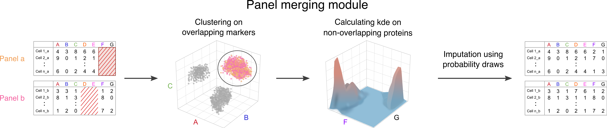

<style type="text/css">

h1.title {
  color: #004d66;
}
h4.author {
  font-style: italic;
  font-size: 18px;
  color: #008cba;
}
h4.date {
  font-style: italic;
  font-size: 16px;
  color: #008cba;
}
h1 { /* Header 1 */
  color: #004d66;
  font-size: 28px;
}
h2 { /* Header 2 */
  color: #004d66;
  font-size: 22px;
}
h3 { /* Header 3 */
  color: #004d66;
  font-size: 16px;
}
pre code, pre, code {
  white-space: pre !important;
  overflow-x: scroll !important;
  word-break: keep-all !important;
  word-wrap: initial !important;
}
</style>


```{r setup, include = FALSE}
knitr::opts_chunk$set(
  strip.white = T, comment = "", tidy.opts=list(width.cutoff=60),tidy=T
)

knitr::opts_knit$set(root.dir = '/home/projects/dp_immunoth/people/s134891/cycombine/')
knitr::opts_chunk$set(tidy.opts=list(width.cutoff=60),tidy=TRUE)
```

<br>

This vignette will introduce the panel merging module of cyCombine which has two main functions:


#. Imputation of non-overlapping channels for whole data sets (`impute_across_panels`)
#. Imputation of single misstained (or in some other way) problematic channels (`salvage_problematic`)


These modules rely on the same main workflow, as represented by this figure:

<br>



<br>
In this vignette, we will look at these functions and also provide a general discussion of panel merging robustness and limitations. Finally, we include benchmarking against existing tools. 


<br>


# Imputation of non-overlapping channels for whole data sets
Mass cytometry and spectral flow cytometry enables quantification of 40+ proteins in parallel on millions of cells. But sometimes that is not enough to deeply characterize the populations of interest. The solution: Use two or more panels on the same cells - i.e. split you samples before staining. When this is done, however, one essentially ends up with two different datasets. Usually, these overlap partially - after all, most cytometry panels contain some of the most important cell type markers; CD3, CD4, CD8, CD14, CD19, CD56 etc. But it still is challenging to jointly analyze the data. The panel merging module of cyCombine can help researchers facing this exact challenge. Based on the overlapping markers, cyCombine is able to impute the values for the non-overlapping set, enabling co-analysis with all the markers across the applied panels.

<br>
Another example, which may be important for larger dataset integration - either across studies or platforms - is data analyzed with two different, partially overlapping panels. 

<br>

## Methodology
cyCombine's cross-dataset merging works by first performing a SOM-based (default 8x8) clustering of the datasets based on all of the overlapping markers. Then, for each cell in one of the datasets, the values for the missing markers are imputed by using the values from cells in the other dataset that fall within the same SOM node. The imputations are made by simulating a multi-dimensional kernel density estimate: Each cell’s missing values are imputed by randomly drawing a cell from the other dataset and adding a Gaussian error, which is based on a draw from a Normal distribution with mean 0 and standard deviation corresponding to the bandwidth of each marker.

However, if there are less than 50 cells from the other dataset within the SOM node, the values for the missing channels are set to NA as imputation would be unreliable.

We refer to the cyCombine vignette with a [two-panel CyTOF dataset](https://biosurf.org/cyCombine_CyTOF_2panels.html) for a panel merging use-case.

In this vignette, we will instead focus a bit on the landscape of integration and imputation, before proceeding to an introduction to imputation of single misstained channels.


<br>

## Discussion
In terms of advantages, the approach of cyCombine is designed to account for the underlying biology by using density draws. This is particularly important because cytometry data are not normally distributed.

In some cases, in which the variance in the marker expression is very low, measures like the median provide a good estimate of the values to be imputed. The unfortunate thing is that those cases are often biologically uninteresting, whereas markers with bimodal expression are often the center of attention. Such markers can either be relevant for distinguishing populations and downstream differential abundance analysis, or within a cluster they may provide insight into differential expression between experimental states. 


When evaluating cyCombine, it is important to consider the following: Because of the use of density draws, it is not possible to use a one-one comparison of cells in a training set before and after imputation. This is because you might actually get some ‘wrong’ estimates with our approach - but there should be a corresponding ‘wrong’ estimate making up for that. The goal of our SOM/density-based approach is to preserve the global structure of the dataset instead of the single cell’s assignment. An additional upside to cyCombine is that it also does not exclude outlier values, as those should be sampled with the frequency that they are actually present in the data. We will get back to this in the benchmarks below.

<br>

Naturally, this approach also has limitations: Since the method relies on the information of the overlapping markers for imputation, this overlap must be of a reasonable size and quality. This is hard to accurately define, but overall, the overlapping set should contain the most important lineage-defining markers, for imputation to work properly. Also, we would err on the side of caution when it comes to the number of markers imputed: Do not impute 100 markers based on five overlapping. How far to push this will depend on the overlap in question and also the samples. If the samples are highly similar, as in a two-panel analysis of the same samples, perhaps it is okay to impute, but if they are very different, such as from different diseases or tissues, one should be more careful.

Furthermore, we will advise against using imputed values for differential expression analysis, as this can be highly sensitive to the values. Instead, panel merging should be viewed as a tool for easing data visualization - you can get *one* UMAP for multi-panel data and the population abundances will be directly comparable sparring researchers from the trouble of having to do cluster matching (difficult) and studying separate plots since data exists in two spaces. In other words, be careful when performing analysis based on imputed values, in order to avoid false inference.


<br>

### Other integration and imputation tools
Previous work by [Abdelaal et al. (2019)](https://doi.org/10.1093/bioinformatics/btz180) suggested the CyTOFmerge approaches for 1) designing panels with an optimal overlap for imputation and 2) imputation based on k-Nearest Neighbors (kNN) and medians. However, the authors state that it is best to use their own panel design tool if panel merging is to work optimally. 

While the idea of designing multiple panels so they have an ideal information-carrying overlap is very good and should be considered best-practice, it is also not carried out in many real-life studies, in which the bioinformatician analyzing the data may only have been included after the data was generated on the CyTOF instrument. This often results in a situation where two panels with sub-optimal overlap have been run, but this is the available data.

As a result, comparing cyCombine and CyTOFmerge directly is not entirely fair, as they are not designed with the same purpose in mind. However, we do provide an example below.


<br>

We must also mention CytoBackBone by [Pereira et al. (2019)](https://doi.org/10.1093/bioinformatics/btz212), which also uses nearest-neighbor imputation. An interesting notion of acceptable neighbors is applied to avoid spurious imputations based on very distinct cells. This is analogous to cyCombine's lack of imputation in cases where a SOM node contains no/very few cells from one of the datasets. Furthermore, they provide a very interesting test case, in which a healthy donor sample was stained with five combinations of the same set of 35 markers, which we will focus on in the next section. This work also tested the impact of the size of the set of overlapping markers using more than 65,000 different combinations, showing that the larger the overlap, the better the imputation quality.

<br>

Alternatively, one could look to the flow cytometry work by [Lee et al. (2011)](https://doi.org/10.1016/j.jbi.2011.03.004), which suggests a clustering-based approach for imputation. This model was however developed for two data files only and relies on the application of domain knowledge regarding marker expression of different cell types. Furthermore, it was only tested on lymphocyte data.

<br>

For combining and integrating datasets, approaches like QFMatch by [Orlova et al. (2018)](https://doi.org/10.1038/s41598-018-21444-4), SIC by [Meehan et al. (2019)](https://doi.org/10.1038/s42003-019-0467-6), and MetaCyto by [Hu et al. (2018)](https://doi.org/10.1016/j.celrep.2018.07.003) have been presented. However, these are focused on combining the results of complete analyses with cluster matching and not on allowing truly integrated analysis from start to end.


<br>

### Benchmark 1 - cyCombine, CytoBackBone, and CyTOFmerge (CytoBackBone dataset)

Along with the CytoBackBone publication, a whole blood dataset from a healthy donor was published (FlowRepository ID: [FR-FCM-ZYV2](http://flowrepository.org/id/FR-FCM-ZYV2)). This donor was stained with five different panels, four of which were subsets of the full panel (#E). We downloaded the five pregated files from the repository and now we will read them and perform panel merging.

Panel #A and #B together have all the 35 markers included in panel #E, with an overlap of 16 markers. Similarly, panel #C and #D together have all the 35 markers included in panel #E, with an overlap of the *same* 16 markers. These 16 markers are, as would be a recommended choice, some of the key lineage markers:
CD1c, CD3, CD4, CD8a, CD11c, CD14, CD16, CD19, CD32, CD64, CD66, CD86, CD123, CD141, Granzyme B, and HLA-DR. In the original article, they conduct an analysis regarding the importance of each backbone marker, in which markers are ranked based on their relative importance (CD3 and CD66 being the most important). We will not conduct a similar analysis, but instead focus on comparing cyCombine and CytoBackBone.

```{r libraries, results = 'hide', warning=FALSE, message=FALSE}
library(cyCombine)
library(tidyverse)

```

```{r loading HEA data, results='hide', warning=F, message=F}
# Set data directory
data_dir <- 'FR-FCM-ZYV2/'

# Load five panels' data - here we assume no substantial batch effects between the five samples
panel_A <- prepare_data(data_dir = data_dir, pattern = '#A', down_sample = F, batch_ids = 'A', sample_ids = 1)
panel_B <- prepare_data(data_dir = data_dir, pattern = '#B', down_sample = F, batch_ids = 'B', sample_ids = 1)
panel_C <- prepare_data(data_dir = data_dir, pattern = '#C', down_sample = F, batch_ids = 'C', sample_ids = 1)
panel_D <- prepare_data(data_dir = data_dir, pattern = '#D', down_sample = F, batch_ids = 'D', sample_ids = 1)
panel_E <- prepare_data(data_dir = data_dir, pattern = '#E', down_sample = F, batch_ids = 'E', sample_ids = 1)
```

We will do panel merging with two panels at a time.
Let us first focus on panels A and B.

```{r panel A+B, results='hide', message=F, warning=F}
# Define the overlap (16 markers)
overlap_AB <- intersect(get_markers(panel_A), get_markers(panel_B))

# Define markers unique to each panel
missing_A <- get_markers(panel_B)[!(get_markers(panel_B) %in% overlap_AB)]
missing_B <- get_markers(panel_A)[!(get_markers(panel_A) %in% overlap_AB)]

# Perform imputations (and measure runtime)
start_time_cC <- Sys.time()
panel_AB <- impute_across_panels(dataset1 = panel_A,
                                 dataset2 = panel_B,
                                 overlap_channels = overlap_AB,
                                 impute_channels1 = missing_A,
                                 impute_channels2 = missing_B)
end_time_cC <- Sys.time()

# Combine the dataframes for each set
panel_AB <- rbind(panel_AB$dataset1, panel_AB$dataset2)

```

And then let us integrate panels C and D.

```{r panel C+D, results='hide', message=F, warning=F}
# Define the overlap (16 markers)
overlap_CD <- intersect(get_markers(panel_C), get_markers(panel_D))

# Define markers unique to each panel
missing_C <- get_markers(panel_D)[!(get_markers(panel_D) %in% overlap_CD)]
missing_D <- get_markers(panel_C)[!(get_markers(panel_C) %in% overlap_CD)]

# Perform imputations
panel_CD <- impute_across_panels(dataset1 = panel_C,
                                 dataset2 = panel_D,
                                 overlap_channels = overlap_CD,
                                 impute_channels1 = missing_C,
                                 impute_channels2 = missing_D)


# Combine the dataframes for each set
panel_CD <- rbind(panel_CD$dataset1, panel_CD$dataset2)

```


Now that both sets of panel pairs have been integrated, we can compare the Earth Mover's Distance to panel E which contained the full set of markers. First, we will look at the densities of each marker - both for the overlapping channels and the imputed ones.


```{r panel density evaluation, results='hide', message=F, warning=F, fig.height=24, fig.width=20}
# And let's look at the marker density of A+B and C+D relative to the full panel (E)
plot_density(uncorrected = panel_E,
             corrected = rbind(panel_AB[,colnames(panel_E)], panel_CD[,colnames(panel_E)]),
             dataset_names = c('Panel E', 'Panel A+B and C+D'),
             ncol = 5)

```


Overall, this looks quite good. Also, it is worth noting that the distributions of CD3 are not completely identical, despite the marker being included in all five panels: So it would be a hard requirement to impose on imputations. Now, we will use the Earth Mover's Distance (EMD) to look at the imputations more quantitatively.


<br>


Because CytoBackBone merging does not maintain the information about the original panel of each cell, we cannot look at per-sample EMDs after correction for CytoBackBone. In order to look at the same metrics for the two tools, we consequently relabel our merged cells from panels A and B with `batch = 'A+B'` and analogously for panels C and D. We can now calculate the EMDs for all batch-batch comparisons (A+B vs. C+D, A+B vs. E, and C+D vs. E).


```{r cycombine evaluation, results='hide', message=F, warning=F, fig.width=20, fig.height=9}
# Combine all datasets
panel_AB$batch <- 'A+B'; panel_CD$batch <- 'C+D'
combined <- rbind(panel_AB[,colnames(panel_E)], panel_CD[,colnames(panel_E)], panel_E)

# EMD calculations for all batches - here we perform these globally, since the datasets are from the same healthy donor sample
emd_all <- compute_emd(df = combined,
                       cell_col = 'sample')[[1]]

boxplot(emd_all, main = 'EMD for all markers (cyCombine)', ylab = 'EMD', col = c('#F8766D', '#619CFF')[as.numeric(names(emd_all) %in% overlap_AB)+1], ylim = c(0,5), las = 2)
legend("topright", legend = c('Overlap', 'Imputed'), col = c('#619CFF', '#F8766D'), pch = 15, cex = 2, bty = 'n')
```


<br>

Now, we compare these results to those of CytoBackBone. In this process, we aim to apply the exact approach presented in the CytoBackBone GitHub and consequently, we load the files again to make sure we are not adding any bias to the analysis.


```{r load cytobackbone, message=F, results='hide', warning=F}
# Load package
library(CytoBackBone, exclude = 'plot') # v. 1.0.0, CytoBackBone has a function called 'plot', which masks the base::plot, but we overwrite that behavior

# Import of FCS files (includes asinh-tranformation)
panel_A_CBB <- import.FCS(paste0(data_dir, "/HEA_profile#A_pregated.fcs"))
panel_B_CBB <- import.FCS(paste0(data_dir, "/HEA_profile#B_pregated.fcs"))
panel_C_CBB <- import.FCS(paste0(data_dir, "/HEA_profile#C_pregated.fcs"))
panel_D_CBB <- import.FCS(paste0(data_dir, "/HEA_profile#D_pregated.fcs"))
panel_E_CBB <- import.FCS(paste0(data_dir, "/HEA_profile#E_pregated.fcs"))
```

<br>

Now that the files are loaded, we are ready to perform the integration with CytoBackBone. Here, we choose to use the normalization of the tool and a threshold of 3, which is a relatively high threshold meaning that more cells will be included in the integrated set.

```{r cytobackbone merging}
# Merging of cytometry profiles using CytoBackBone
# Panels A + B (measuring runtime)
start_time_CBB <- Sys.time()
panel_AB_CBB <- CytoBackBone::merge(FCS1 = panel_A_CBB,
                                    FCS2 = panel_B_CBB,
                                    BBmarkers = overlap_AB,
                                    th = 3,
                                    leftout = T,
                                    normalize = T)
end_time_CBB <- Sys.time()

# Panels C + D
panel_CD_CBB <- CytoBackBone::merge(FCS1 = panel_C_CBB,
                                    FCS2 = panel_D_CBB,
                                    BBmarkers = overlap_CD,
                                    th = 3,
                                    leftout = T,
                                    normalize = T)

```

In the case of panels A + B, we observe that 155,459 cells are part of the integrated set. For C + D, that number is 141,026. Using cyCombine, *all* cells were actually integrated resulting in 322,209 and 304,662 cells in the merged sets, respectively. This can be an important factor in downstream analysis, especially considering the potential loss of statistical power by having few cells in your dataset.


We will now look at the density plots for CytoBackBone.

```{r panel density evaluation 2, results='hide', message=F, warning=F, fig.height=24, fig.width=20}
# And let's look at the marker density of A+B and C+D relative to the full panel (E)
# First, we extract the marker expression values
panel_E_CBB_exp <- as.data.frame(panel_E_CBB@intensities); colnames(panel_E_CBB_exp) <- panel_E_CBB@markers; panel_E_CBB_exp$batch = 'E'
panel_AB_CBB_exp <- as.data.frame(panel_AB_CBB$merged@intensities); colnames(panel_AB_CBB_exp) <- panel_AB_CBB$merged@markers; panel_AB_CBB_exp$batch = 'A+B'
panel_CD_CBB_exp <- as.data.frame(panel_CD_CBB$merged@intensities); colnames(panel_CD_CBB_exp) <- panel_CD_CBB$merged@markers; panel_CD_CBB_exp$batch = 'C+D'

plot_density(uncorrected = panel_E_CBB_exp,
             corrected = rbind(panel_AB_CBB_exp[,colnames(panel_E_CBB_exp)], panel_CD_CBB_exp[,colnames(panel_E_CBB_exp)]),
             dataset_names = c('Panel E', 'Panel A+B and C+D'),
             ncol = 5)

```


Again, we will use the Earth Mover's Distance (EMD) to look at the imputations more quantitatively.

```{r cytobackbone evaluation, results='hide', message=F, warning=F, fig.width=20, fig.height=9}
# Combine all datasets
combined_CBB <- rbind(panel_AB_CBB_exp[,colnames(panel_E_CBB_exp)], panel_CD_CBB_exp[,colnames(panel_E_CBB_exp)], panel_E_CBB_exp)
combined_CBB$sample <- '1'

# EMD calculations for all batches - here we perform these globally, since the datasets are from the same healthy donor sample
emd_all_CBB <- compute_emd(df = combined_CBB,
                           cell_col = 'sample')[[1]]

boxplot(emd_all_CBB, main = 'EMD for all markers (CytoBackBone)', ylab = 'EMD', col = c('#F8766D', '#619CFF')[as.numeric(names(emd_all_CBB) %in% overlap_AB)+1], ylim = c(0,5), las = 2)
legend("topright", legend = c('Overlap', 'Imputed'), col = c('#619CFF', '#F8766D'), pch = 15, cex = 2, bty = 'n')
```

The EMD ranges for cyCombine and CytoBackBone are similar - i.e. both tools seem to be most challenged with markers such as CXCR4 and MIP1b.


<br>

Now, it is time to test the performance of CyTOFmerge on the dataset.

```{r CyTOFmerge}

# Sourcing the CyTOFMerge script from GitHub
devtools::source_url('https://github.com/tabdelaal/CyTOFmerge/blob/master/CombineFCS.R?raw=TRUE')

# Imputations for panel A + B (with timing)
start_time_CM <- Sys.time()

panel_AB_CM <- CombineFCS(FCSfile1 = paste0(data_dir, 'HEA_profile#A_pregated.fcs'), RelevantMarkers1 = 1:25,
                          FCSfile2 = paste0(data_dir, 'HEA_profile#B_pregated.fcs'), RelevantMarkers2 = 1:26,
                          arcsinhTrans = T)

end_time_CM <- Sys.time()


# Imputations for panel C + D
panel_CD_CM <- CombineFCS(FCSfile1 = paste0(data_dir, 'HEA_profile#C_pregated.fcs'), RelevantMarkers1 = 1:24,
                          FCSfile2 = paste0(data_dir, 'HEA_profile#D_pregated.fcs'), RelevantMarkers2 = 1:27,
                          arcsinhTrans = T)
```


We will now look at the density plots for CyTOFmerge.

```{r panel density evaluation 3, results='hide', message=F, warning=F, fig.height=24, fig.width=20}
# And let's look at the marker density of A+B and C+D relative to the full panel (E)
# First, we extract the marker expression values
panel_E_CM_exp <- panel_E[,c(cyCombine::get_markers(panel_E), 'batch')]
panel_AB_CM_exp <- panel_AB_CM; panel_AB_CM_exp$batch = 'A+B'
panel_CD_CM_exp <- panel_CD_CM; panel_CD_CM_exp$batch = 'C+D'

plot_density(uncorrected = panel_E,
             corrected = rbind(panel_AB_CM_exp[,colnames(panel_E_CM_exp)], panel_CD_CM_exp[,colnames(panel_E_CM_exp)]),
             dataset_names = c('Panel E', 'Panel A+B and C+D'),
             ncol = 5)

```


Again, we will use the Earth Mover's Distance (EMD) to look at the imputations more quantitatively.

```{r cytofmerge evaluation, results='hide', message=F, warning=F, fig.width=20, fig.height=9}
# Combine all datasets
combined_CM <- rbind(panel_AB_CM_exp[,colnames(panel_E_CM_exp)], panel_CD_CM_exp[,colnames(panel_E_CM_exp)], panel_E_CM_exp)
combined_CM$sample <- '1'

# EMD calculations for all batches - here we perform these globally, since the datasets are from the same healthy donor sample
emd_all_CM <- compute_emd(df = combined_CM,
                           cell_col = 'sample')[[1]]

boxplot(emd_all_CM, main = 'EMD for all markers (CyTOFmerge)', ylab = 'EMD', col = c('#F8766D', '#619CFF')[as.numeric(names(emd_all_CM) %in% overlap_AB)+1], ylim = c(0,5), las = 2)
legend("topright", legend = c('Overlap', 'Imputed'), col = c('#619CFF', '#F8766D'), pch = 15, cex = 2, bty = 'n')
```

The EMD ranges for CyTOFmerge are very similar to those of the other two tools - i.e. all tools seem to be most challenged with markers such as CXCR4 and MIP1b. However, visual inspection of the density plots, e.g. for CCR5, does reveal a somewhat different data distribution for the measured and CyTOFmerge-imputed sets.


A final comparison parameter is the runtime. Here we do a small comparison of cyCombine, CytoBackBone, and CyTOFmerge on a machine with 40 cores and 100 gb memory:

```{r runtime}
# Runtime for cyCombine on panels A + B
end_time_cC - start_time_cC

# Runtime for CytoBackBone on panels A + B
end_time_CBB - start_time_CBB

# Runtime for CyTOFmerge on panels A + B
end_time_CM - start_time_CM
```

While neither of these runtimes are terrible, it is worth considering that cyCombine is **a lot** faster than the two other tools.

<br>

In conclusion, the tools have similar performance in terms of the global distributions as seen from both the EMD calculations and the density plots. However, cyCombine integrates all cells and has the shortest runtime.


<br>

### Benchmark 2 - cyCombine and CyTOFmerge (CyTOFmerge dataset)

In order to compare the performance of cyCombine panel merging more fairly to that of CyTOFmerge, we will demonstrate the imputation from the two tools using the VorteX set (39 markers), which is also used for validation in the CyTOFmerge article. We compare to the workflow presented in the CyTOFmerge vignette (available on their GitHub).

In the CyTOFmerge vignette, the most informative markers are selected using correlation and PCA. The top 11 markers are found to be MHCII, Ly6C, CD11b, B220, IgM, CD44, CD16_32, Sca1, CD43, IgD, and SiglecF, and these are the markers deemed to be suitable as the overlap for imputation.

Using an annotated set of ~500,000 cells, they simulate two panels by splitting the dataset in two parts having equal numbers of cells and sharing the 11 markers above. The remaining 28 markers are split, such that one half of the data has 14, and the other half has the other 14. The values of these 28 markers are then imputed for the opposite halves. Their raw and imputed data can be obtained from FlowRepository ID: FR-FCM-ZYVJ.


Here, we load their original data (before splitting and imputation).

```{r Vortex load CyTOFmerge original}
# Loading the data set before imputation - using code from the CyTOFmerge vignette (modified for clarity of variable names)
VorteX.data = data.frame()
Temp <- flowCore::read.FCS('FlowRepository_FR-FCM-ZYVJ_files/VortexOrg.fcs',transformation = FALSE, truncate_max_range = FALSE)
colnames(Temp@exprs) <- Temp@parameters@data$desc
VorteX.data = as.data.frame(Temp@exprs)[,c(1:40)]      # columns (1:39) contain markers, column 40 contains the unique cell id
VarNames = colnames(VorteX.data)
Org.order <- order(VorteX.data[,40])
VorteX.data <- VorteX.data[Org.order,]

head(VorteX.data)

```


We then load their dataset after imputation.

```{r Vortex load CyTOFmerge imputed}
# Using the code from the CyTOFmerge vignette to load imputed dataset (modified for clarity of variable names)
CyTOFmerge.data = data.frame()
Temp <- flowCore::read.FCS('FlowRepository_FR-FCM-ZYVJ_files/VortexIMP.fcs',transformation = FALSE, truncate_max_range = FALSE)
colnames(Temp@exprs) <- Temp@parameters@data$desc
CyTOFmerge.data = as.data.frame(Temp@exprs)[,c(1:40)]      # columns (1:39) contain markers, column 40 contains the unique cell id
Imp.order <- order(CyTOFmerge.data[,40])
CyTOFmerge.data <- CyTOFmerge.data[Imp.order,]
CyTOFmerge.data <- CyTOFmerge.data[,colnames(VorteX.data)]     # put the imputed data columns in the same order as the original data

head(CyTOFmerge.data)

# Changing name of id column to be more clear
colnames(VorteX.data)[40] <- colnames(CyTOFmerge.data)[40] <- 'id'

```


<br>
In order to compare, we now use cyCombine on the original dataset, split into the same parts as for CyTOFmerge. Finally, imputation is performed.

```{r Vortex impute cyCombine, message=F, warning=F}
# Imputing the non-top11 markers of the VorteX set using cyCombine
# Defining the overlap
overlap_VorteX <- c('MHCII', 'Ly6C', 'CD11b', 'B220', 'IgM', 'CD44', 'CD16_32', 'Sca1', 'CD43', 'IgD', 'SiglecF')

# Getting the indeces of the two dataset halves (this is how the data was split during imputation with CyTOFmerge)
X1 <- 1:(nrow(CyTOFmerge.data)/2)
X2 <- (nrow(CyTOFmerge.data)/2+1):nrow(CyTOFmerge.data)

# Define markers unique to each panel - based on CyTOFmerge
missing_1 <- c('CD115', 'CD11c', 'CD23', 'Foxp3', 'FceR1a', 'CCR7', 'NKp46', 'CD138', 'Ly6G', 'CD150', 'CD103', 'CD25', 'TCRgd', 'Ter119')
missing_2 <- c('CD5', 'CD27', 'F480', 'cKit', 'CD64', 'CD34', 'CD4', 'CD45.2', '120g8', 'CD3', 'TCRb', 'CD19', 'CD49b', 'CD8')


# The markers and indeces from each half can also be checked - should be true
all(CyTOFmerge.data[X1,c(overlap_VorteX, missing_2)] == VorteX.data[X1,c(overlap_VorteX, missing_2)])
all(CyTOFmerge.data[X2,c(overlap_VorteX, missing_1)] == VorteX.data[X2,c(overlap_VorteX, missing_1)])

# The markers and indeces from each half can also be checked - should be (mostly) false
table(CyTOFmerge.data[X1,missing_1] == VorteX.data[X1,missing_1])
table(CyTOFmerge.data[X2,missing_2] == VorteX.data[X2,missing_2])

# Split data and impute
panel_1 <- VorteX.data[X1,c(overlap_VorteX, missing_2)]
panel_2 <- VorteX.data[X2,c(overlap_VorteX, missing_1)]


# Perform imputations
Imputed_cC <- impute_across_panels(dataset1 = panel_1,
                                   dataset2 = panel_2,
                                   overlap_channels = overlap_VorteX,
                                   impute_channels1 = missing_1,
                                   impute_channels2 = missing_2)

```

<br>

Now, let us have a look at some density plots for the original and imputed values for the 28 imputed markers. We will look at them in sets of 14 markers imputed for each half of the data and compare the distributions of cyCombine values, CyTOFmerge values, and the original values.

```{r panel density evaluation VorteX, results='hide', message=F, warning=F, fig.height=12, fig.width=20}
# Setting some parameters to aid in plotting (batch and id)
Imputed_cC$dataset1$batch <- 'cyCombine 1'; Imputed_cC$dataset1$id <- X1
Imputed_cC$dataset2$batch <- 'cyCombine 2'; Imputed_cC$dataset2$id <- X2
VorteX.data$batch <- 'True 1'; VorteX.data$batch[X2] <- 'True 2'
CyTOFmerge.data$batch <- 'CyTOFmerge 1'; CyTOFmerge.data$batch[X2] <- 'CyTOFmerge 2'

# Plotting the true and imputed values for the first half of the data
plot_density(uncorrected = VorteX.data[X1,],
             corrected = rbind(CyTOFmerge.data[X1,], Imputed_cC$dataset1),
             dataset_names = c('True', 'Imputed'),
             ncol = 5, markers = missing_1)


# Plotting the true and imputed values for the second half of the data
plot_density(uncorrected = VorteX.data[X2,],
             corrected = rbind(CyTOFmerge.data[X2,], Imputed_cC$dataset2),
             dataset_names = c('True', 'Imputed'),
             ncol = 5, markers = missing_2)
```

<br>

A brief look at the plots does not reveal dramatic difference between the two tools - however, looking more closely at some markers including Ly6G and CD45.2, there appears to be a higher degree of similarity between cyCombine's imputed values and the original distribution.

<br>

We also evaluate the results using the EMD and MAD score to get a quantitative measure:

```{r EMD evaluation CyTOFmerge}
# Giving all cells a label for GLOBAL EMD evaluation
Imputed_cC$dataset1$label <- Imputed_cC$dataset2$label <- 1
VorteX.data$label <- CyTOFmerge.data$label <- 1

# EMD calculation between the different original and imputed datasets - first half
emd_half1 <- compute_emd(df = rbind(VorteX.data[X1,], Imputed_cC$dataset1, CyTOFmerge.data[X1,]),
                         cell_col = 'label',
                         markers = missing_1)[[1]]


# EMD calculation between the different original and imputed datasets - second half
emd_half2 <- compute_emd(df = rbind(VorteX.data[X2,], Imputed_cC$dataset2, CyTOFmerge.data[X2,]),
                         cell_col = 'label',
                         markers = missing_2)[[1]]


# Make a boxplot of all EMD values for each method compared to the original dataset
emd_CM <- c(sapply(emd_half1, function(x) {x['CyTOFmerge 1','True 1']}), sapply(emd_half2, function(x) {x['CyTOFmerge 2','True 2']}))
emd_cC <- c(sapply(emd_half1, function(x) {x['cyCombine 1','True 1']}), sapply(emd_half2, function(x) {x['cyCombine 2','True 2']}))

boxplot(emd_CM, emd_cC, names = c('CyTOFmerge', 'cyCombine'), ylab = 'EMD compared to original', main = 'EMDs for all imputed markers')

```

```{r MAD CyTOFmerge}

# MAD score comparing the original and CyTOFmerge dataset - both halves
mad_half1_CM <- evaluate_mad(VorteX.data[X1,], CyTOFmerge.data[X1,], markers = missing_1)
mad_half2_CM <- evaluate_mad(VorteX.data[X2,], CyTOFmerge.data[X2,], markers = missing_2)

# MAD score comparing the original and cyCombine dataset - both halves
mad_half1_cC <- evaluate_mad(VorteX.data[X1,], Imputed_cC$dataset1, markers = missing_1)
mad_half2_cC <- evaluate_mad(VorteX.data[X2,], Imputed_cC$dataset2, markers = missing_2)

```

Based on the EMDs and MAD scores, cyCombine produces imputed distributions which are more similar to the original data than CyTOFmerge. Additionally, there is no information loss for the VorteX set when using cyCombine. CyTOFmerge loses a bit more information, which is reflected in the narrower distributions for some markers as seen above. Furthermore, while still relatively small, the EMDs compared to the original data are larger than when using cyCombine.

In this specific dataset, one could however argue that the imputations produced by CyTOFmerge will most likely not impact any downstream processing (clustering, visualizations, etc.), since the distributions are still in the same range as the original dataset. However, why not aim to get the distributions as correct as possible?


<br>


One key take-away from this analysis, which also extends the point above, is however that all of the 28 imputed markers do not have much variation in the original dataset. The majority of these markers most likely would not drive a clustering since most values for almost all markers are below 2.5. This also means that these markers are relatively easy to compute by simply taking a median - which is what CyTOFmerge does. Because of CyTOFmerge's feature selection, it is quite certain that the hardest-to-impute markers (with all the variance) will not need imputing. This is of course a good thing when it comes to trusting the imputations, but the question remains if imputations are actually interesting when they are unimodal.


Let us have a quick look at the density plots for the 11 'overlapping' markers to visualize their relatively high degree of variance:

```{r density overlap CyTOFmerge, results='hide', message=F, warning=F, fig.height=10, fig.width=20}
# Plot density for overlapping markers
df <- VorteX.data %>%
  dplyr::select(all_of(overlap_VorteX))
p <- list()
for (c in 1:length(overlap_VorteX)) {
  p[[c]] <- df %>% ggplot(aes_string(x = overlap_VorteX[c],
    y = 1)) + ggridges::geom_density_ridges(alpha = 0.4) +
    theme_bw()
}

cowplot::plot_grid(cowplot::plot_grid(plotlist = p,
      ncol = 6))
```


So, this result brings us back to the question of when we **should** impute. As stated above, a reasonable overlap is needed. But the size of this overlap depends on both the overlapping and non-overlapping markers. As an example, it may be reasonable to impute CD5 from an overlap containing CD3. But imputing a B cell marker from a set overlapping T cell-exclusive markers is potentially a bad idea. Ideally, one would take a dataset and test the imputation quality for all different combinations of overlapping markers ranging from 1 to n (where n is the number of markers in the data). However, if a dataset had 30 markers, the combinatorial space for this would have a size of 1,073,741,823. A dataset with 40 markers would have 1.1*10<sup>12</sup> options.

```{r n-choose-k}
sum(choose(30, 1:30))
sum(choose(40, 1:40))
```


Furthermore, there is actually a caveat with cyCombine, when using a dataset that is split in two (like the VorteX) example: Because the datasets are from the exact same distribution and the tool always performs nearly perfectly - since it samples from the other half, which is 'identical' - with the exception of the added 'noise' from the bandwidth. This means that the performance is very good even when using only a very small set of overlapping markers. Of course, the clustering can also be impacted when only a few markers are in the overlap, since so little information is available in those cases.

Furthermore, this also means that since cyCombine almost "copies" information from one batch to another within each cluster, it is assumed that the samples that one imputes from, are similar to those that are imputed for. This is also why we recommend against differential expression analysis on imputed values.


<br>

As a consequence, a proper testing of cyCombine makes more sense for different samples, which have overlapping markers. Even between two healthy PBMC samples, there is variation in population frequencies, so these are actually a true test for cyCombine. That brings us to benchmark 3.


<br>

### Benchmark 3 - cyCombine on different healthy donors

Let us consider some of the healthy donor PBMC samples from a set of CyTOF data from [Ogishi et al. (2021)](https://doi.org/10.4049/jimmunol.2000854) (FlowRepository ID: FR-FCM-Z3YK). We will use nine samples - four from batch 1 (HC01-HC05) and four from batch 6 (HC14, 16, 20, 24-33). These samples comprise 3,969,544 cells.

This data will be processed in two ways:

1. Simple batch correction on all 38 markers.
2. Removing 13 markers from each batch, batch correcting the overlap (n = 12), and performing imputation on the removed markers. 


This will be followed by a mini-analysis of the generated datasets, which should aid in quantifying both the degree of information loss from having a smaller overlap and performing imputations. It should also serve to prove the robustness of the cyCombine imputation. In part 2, we will remove both a set of relatively easy-to-impute markers, and a set of relatively hard-to-impute markers - based on the degree of variance of markers.

```{r setup 2, include = FALSE}
knitr::opts_knit$set(root.dir = '/home/projects/dp_immunoth/people/s134891/cycombine/Benchmarking/')
```

First, we read the data set:

```{r Ogishi example load data}
# Read data
ogishi <- readRDS('cycombine_ogishi_uncorrected.RDS')

# Filter to HC01-HC09
ogishi <- ogishi %>%
  dplyr::filter(sample %in% paste0('HC', c(paste0(0, 1:5), 14, 16, 20, 24:33)) & batch %in% paste0('Batch', c(1,6))) %>%
  droplevels() #%>%
  # dplyr::sample_n(100000) %>%
  # dplyr::arrange(id)

# Get the markers
og_markers <- get_markers(ogishi)

# A brief look at the data
ogishi
```
<br>

Now, we batch correct the data (two batches, no co-variates):

```{r Ogishi example batch cor, results = 'hide', warning=FALSE, message=FALSE}
# Run batch correction - full panel (38 markers)
ogishi_bc <- ogishi %>%
  batch_correct(xdim = 8,
                ydim = 8,
                norm_method = 'scale',
                markers = og_markers)

```

<br>

To get an idea about the extent of batch effects and to survey the variance of each marker, we will make density plots for the corrected and uncorrected datasets.

```{r Ogishi example removing markers 1, results='hide', message=F, warning=F, fig.height=24, fig.width=20}
plot_density(ogishi, ogishi_bc, markers = og_markers)

```

Now that we have a 'ground truth' dataset, which is integrated across batches, we can make the imputation tests. 
First, let us look at the MAD for all the markers. 


```{r Ogishi example removing markers 2}
# Calculating the MAD for all markers (before correction) for each batch and taking the mean per marker
ogishi$label <- 1
sort(colMeans(do.call(rbind, compute_mad(ogishi)[[1]])), decreasing = T)

```

We observe that the markers with most variation are CD27, CD4, CCR7, CD38, CD45RA, CD127, CD3, CD8, and HLA-DR. This is also reflected in the density plots, where the mentioned markers have clear bimodal patterns.

For a hard-to-impute set, we could have an overlap containing: CD57, CD117, CD209, PD1, CD86, CD123, CCR6, CX3CR1, CD20, gdTCR, CD11b, and CD161.
For an easy-to-impute set, we could pick an overlap consisting of: CD27, CD4, CCR7, CD38, CD45RA, CD127, CD3, CD8, CD56, CD19, HLA-DR, and CD45.


```{r Ogishi example removing markers 3}
# Defining the overlap
overlap_hard <- c('CD57', 'CD117', 'CD209', 'PD1', 'CD86', 'CD123', 'CCR6', 'CX3CR1', 'CD20', 'gdTCR', 'CD11b', 'CD161')
overlap_easy <- c('CD27', 'CD4', 'CCR7', 'CD38', 'CD45RA', 'CD127', 'CD3', 'CD8', 'CD56', 'CD19', 'HLADR', 'CD45')

exclude1_hard <- og_markers[!(og_markers %in% overlap_hard)][seq(1,26,2)]
exclude2_hard <- og_markers[!(og_markers %in% overlap_hard)][seq(2,26,2)]

exclude1_easy <- og_markers[!(og_markers %in% overlap_easy)][seq(1,26,2)]
exclude2_easy <- og_markers[!(og_markers %in% overlap_easy)][seq(2,26,2)]


# Splitting data
hard_1 <- ogishi %>%
  dplyr::filter(batch == 'Batch1') %>%
  dplyr::select(-all_of(exclude1_hard))

hard_2 <- ogishi %>%
  dplyr::filter(batch == 'Batch6') %>%
  dplyr::select(-all_of(exclude2_hard))


easy_1 <- ogishi %>%
  dplyr::filter(batch == 'Batch1') %>%
  dplyr::select(-all_of(exclude1_easy))

easy_2 <- ogishi %>%
  dplyr::filter(batch == 'Batch6') %>%
  dplyr::select(-all_of(exclude2_easy))


non_markers <- cyCombine::non_markers[cyCombine::non_markers %in% colnames(ogishi)]

```


Since there are no batch effects within the partitions (all samples are from the same batch already), we can proceed to the combining of the two sets. The first step is batch correction on the overlapping markers, and the second step is imputation of the non-overlapping markers.


```{r Ogishi example imputation easy, results = 'hide', warning=FALSE, message=FALSE}
# Generate a combined tibble
df_easy <- rbind(easy_1[,c(overlap_easy, non_markers)], 
                 easy_2[,c(overlap_easy, non_markers)])

# Batch correct based on overlapping markers
co_corrected_easy <- batch_correct(df_easy,
                                   xdim = 8,
                                   ydim = 8,
                                   norm_method = 'scale',
                                   markers = overlap_easy)

# Add non-overlapping markers back to df
co_corrected_easy1 <- bind_cols(co_corrected_easy[co_corrected_easy$batch == 'Batch1',], easy_1[,exclude2_easy])
co_corrected_easy2 <- bind_cols(co_corrected_easy[co_corrected_easy$batch == 'Batch6',], easy_2[,exclude1_easy])


# Imputation for whole panels
impute_easy <- impute_across_panels(dataset1 = co_corrected_easy1, 
                                    dataset2 = co_corrected_easy2,
                                    overlap_channels = overlap_easy, 
                                    impute_channels1 = exclude1_easy,
                                    impute_channels2 = exclude2_easy)
```


```{r Ogishi example imputation hard, results = 'hide', warning=FALSE, message=FALSE}
# Generate a combined tibble
df_hard <- rbind(hard_1[,c(overlap_hard, non_markers)], 
                 hard_2[,c(overlap_hard, non_markers)])

# Batch correct based on overlapping markers
co_corrected_hard <- batch_correct(df_hard,
                                   xdim = 8,
                                   ydim = 8,
                                   norm_method = 'scale',
                                   markers = overlap_hard)

# Add non-overlapping markers back to df
co_corrected_hard1 <- bind_cols(co_corrected_hard[co_corrected_hard$batch == 'Batch1',], hard_1[,exclude2_hard])
co_corrected_hard2 <- bind_cols(co_corrected_hard[co_corrected_hard$batch == 'Batch6',], hard_2[,exclude1_hard])


# Imputation for whole panels
impute_hard <- impute_across_panels(dataset1 = co_corrected_hard1, 
                                    dataset2 = co_corrected_hard2,
                                    overlap_channels = overlap_hard, 
                                    impute_channels1 = exclude1_hard,
                                    impute_channels2 = exclude2_hard)
```


Now, we have four versions of the data - the original set, the batch corrected set, the 'easy' imputed set, and the 'hard' imputed set. The next step is to investigate how these datasets look - both in terms of direct similarity to the original set, but also in relation to clustering, visualization and abundance analysis.


```{r Ogishi example analyses 1, fig.height=7, fig.width=10}

# Now we have the three datasets after their respective corrections
# ogishi_bc
ogishi_easy <- rbind.data.frame(impute_easy$dataset1[,colnames(ogishi_bc)], impute_easy$dataset2[,colnames(ogishi_bc)])
ogishi_hard <- rbind.data.frame(impute_hard$dataset1[,colnames(ogishi_bc)], impute_hard$dataset2[,colnames(ogishi_bc)])

# Set a label column to all 1's for intra-batch comparisons (globally)
ogishi$label <- ogishi_bc$label <- ogishi_hard$label <- ogishi_easy$label <- 1
ogishi_bc$batch <- paste0(ogishi_bc$batch, '_bc')
ogishi_easy$batch <- paste0(ogishi_easy$batch, '_easy')
ogishi_hard$batch <- paste0(ogishi_hard$batch, '_hard')


# Remove any lines with an NA
ogishi_easy <- tidyr::drop_na(ogishi_easy)
ogishi_hard <- tidyr::drop_na(ogishi_hard)

# Now let us calculate some EMDs for the comparisons within each batch - batch 1 original compared to the three 'generated' batch 1 data sets - and similar for batch 6
emds <- compute_emd(rbind(ogishi, ogishi_bc, ogishi_easy, ogishi_hard))[[1]]

boxplot(
  sapply(emds, function(x) {x['Batch1', 'Batch1_bc']}),
  sapply(emds, function(x) {x['Batch1', 'Batch1_easy']}),
  sapply(emds, function(x) {x['Batch1', 'Batch1_hard']}),
  sapply(emds, function(x) {x['Batch6', 'Batch6_bc']}),
  sapply(emds, function(x) {x['Batch6', 'Batch6_easy']}),
  sapply(emds, function(x) {x['Batch6', 'Batch6_hard']}),
  names = paste('Batch', rep(c(1,6), each = 3), c('bc', 'easy', 'hard')),
  main = 'EMDs when comparing to original data',
  col = RColorBrewer::brewer.pal(3, 'Set2')
)

```

<br>

The EMDs are actually quite similar for each marker when comparing the original set - within a batch - for each of the three processed sets. However, there is a longer tail for the "hard" imputation set - and also a slightly higher max for "easy" than plain batch correction.


<br>

We can also look at the UMAPs for the three sets.

<br>

```{r Ogishi example analyses 2, fig.height=7, fig.width=21, message=F}
#### SOM clustering and dimensionality reduction - using all 38 markers
# Making a function to run on the three corrected sets
cluster_and_plot <- function(df, grid_size = 6, umap_size = 20000,
                             name = 'data', seed = 8265) {
  
  # Generate labels using a SOM - since we are going for more direct clustering, we will use a smaller grid (6x6) -- 
  # perhaps we need to perform meta clustering to make it proper analysis-like?
  labels <- df %>%
    create_som(seed = seed,
               xdim = grid_size,
               ydim = grid_size,
               markers = og_markers)
  
  df <- df %>%
    dplyr::mutate(som = as.factor(labels))
  
  # Down-sampling for plotting
  set.seed(seed)
  df_sliced <- df %>%
    dplyr::slice_sample(n = umap_size)
  
  # UMAP plot for all markers - batch corrected
  umap <- df_sliced %>%
    cyCombine::plot_dimred(name = name, 
                           type = "umap", 
                           markers = og_markers, 
                           return_coord = T)
  
  cmb_df <- df_sliced %>%
    mutate(UMAP1 = umap$dimred[,1],
           UMAP2 = umap$dimred[,2])
  
  # Get a single id from each cluster to indicate the stability
  set.seed(seed)
  ids <- cmb_df %>% 
    dplyr::group_by(som) %>% 
    dplyr::sample_n(1) %>% 
    dplyr::ungroup() %>% 
    dplyr::pull(id)
  
  p <- ggplot(cmb_df, aes(x = UMAP1, y = UMAP2)) +
    geom_point(aes(color = som), alpha = 0.3, size = 0.4) +
    geom_text(aes(label = ifelse(id %in% ids, 
                                 as.character(som),'')), size = 6, hjust = 0, vjust = 0) +
    theme_bw() + theme(plot.title = element_text(hjust = 0.5)) +
    ggtitle(paste0('UMAP - ', name)) +
    guides(color = guide_legend(override.aes = list(alpha = 1, size = 1), title = 'SOM node'))
  
  p1 <- list()
  for (m in og_markers) {
    p1[[m]] <- ggplot(df, aes_string(x = 'som', y = m)) +
      geom_violin(aes(fill = som)) +
      theme_bw()
  }
  p2 <- ggpubr::ggarrange(plotlist = p1, common.legend = T)
  
  return(list(umap = p, vln = p2))
}

p_bc <- cluster_and_plot(ogishi_bc, name = "batch corrected")
p_easy <- cluster_and_plot(ogishi_easy, name = "'easy-to-impute' overlap")
p_hard <- cluster_and_plot(ogishi_hard, name = "'hard-to-impute' overlap")

cowplot::plot_grid(p_bc$umap, p_easy$umap, p_hard$umap, ncol = 3)


```


<!-- ```{r Ogishi example analyses 2, fig.height=7, fig.width=21, message=F} -->
<!-- # Labeling clusters - based on violin plots (batch corrected) -->
<!-- p_bc$vln -->

<!-- ``` -->


<!-- ```{r Ogishi example analyses 2 labels} -->
<!-- # Label all the batch corrected populations -->
<!-- labels_bc <- c('B cells', 'B cells', 'Dbl. neg. T cells', 'Naive CD4+ T cells', 'Naive CD4+ T cells', 'Naive CD4+ T cells', -->
<!--                'CD38+ CD123+', 'B cells', 'Dbl. neg. T cells', 'CM CD4+ T cells', 'CM CD4+ T cells', 'CM CD4+ T cells', -->
<!--                'NK cells', 'NK cells', 'Tregs', 'CM CD4+ T cells', 'CM CD4+ T cells', 'EM CD4+ T cells', -->
<!--                'NK cells', 'CD45lo cells', 'CD45lo cells', 'EM CD4+ T cells', 'CM CD4+ T cells', 'EM CD8+ T cells (CD161+)', -->
<!--                'Classical monocytes', 'Non-classical monocytes', 'EM CD8+ T cells', 'Dbl. neg. T cells', 'EM CD8+ T cells', 'Naive CD8+ T cells', -->
<!--                'Classical monocytes', 'Classical monocytes', 'Dbl. neg. T cells', 'CD8+ TEMRA cells', 'CM CD8+ T cells', 'Naive CD8+ T cells') -->
<!-- ``` -->


<!-- ```{r Ogishi example analyses 3, fig.height=7, fig.width=21, message=F} -->
<!-- # Labeling clusters - based on violin plots (easy) -->
<!-- p_easy$vln -->

<!-- ``` -->


<!-- ```{r Ogishi example analyses 3 labels} -->
<!-- # Label all the 'easy-to-impute' populations -->
<!-- labels_easy <- c('Classical monocytes', 'Classical monocytes', 'Naive CD4+ T cells', 'Naive CD4+ T cells', 'Naive CD4+ T cells', 'Naive CD4+ T cells', -->
<!--                'Classical monocytes', 'Non-classical monocytes', 'Naive CD4+ T cells', 'Naive CD4+ T cells', 'Naive CD4+ T cells', 'CM CD4+ T cells', -->
<!--                'NK cells', 'CD38+ CD123+', 'CD45lo cells', 'CD4+ T cells', 'CD4+ T cells', 'CD4+ T cells', -->
<!--                'NK cells', 'NK cells', '', '', '', 'Tregs', -->
<!--                'B cells', '', '', '', '', '', -->
<!--                'B cells', 'B cells', '', '', '', '') -->


<!-- # SOM = 9 was slightly CD14+... CD8 is relatively high now... -->

<!-- #  -->
<!-- #                'B cells', 'Dbl. neg. T cells', 'Naive CD4+ T cells', -->
<!-- #                'CD38+ CD123+', 'B cells', 'CM CD4+ T cells' -->
<!-- #                'NK cells', 'Tregs', 'EM CD4+ T cells', -->
<!-- #                'CD45lo cells', 'EM CD8+ T cells (CD161+)', -->
<!-- #                'Classical monocytes', 'Non.classical monocytes', 'EM CD8+ T cells', 'Naive CD8+ T cells', -->
<!-- #                'CD8+ TEMRA cells', -->
<!-- ``` -->


<!-- ```{r Ogishi example analyses 4, fig.height=7, fig.width=21, message=F} -->
<!-- # Labeling clusters - based on violin plots (hard) -->
<!-- p_hard$vln -->

<!-- ``` -->


<!-- ```{r Ogishi example analyses 4 labels} -->
<!-- # Label all the 'hard-to-impute' populations -->
<!-- labels_hard <- c('', '', '', '', '', '', -->
<!--                '', '', '', '', '', '', -->
<!--                '', '', '', '', '', '', -->
<!--                '', '', '', '', '', '', -->
<!--                '', '', '', '', '', '', -->
<!--                '', '', '', '', '', '') -->
<!-- #  -->
<!-- #                'B cells', 'Dbl. neg. T cells', 'Naive CD4+ T cells', -->
<!-- #                'CD38+ CD123+', 'B cells', 'CM CD4+ T cells' -->
<!-- #                'NK cells', 'Tregs', 'EM CD4+ T cells', -->
<!-- #                'CD45lo cells', 'EM CD8+ T cells (CD161+)', -->
<!-- #                'Classical monocytes', 'Non.classical monocytes', 'EM CD8+ T cells', 'Naive CD8+ T cells', -->
<!-- #                'CD8+ TEMRA cells', -->


<!-- ``` -->


<!-- ```{r, eval=F} -->

<!-- # Making a function to run on the three corrected sets -->
<!-- plot_umap <- function(umap, labels, name = 'data') { -->

<!--   cmb_df <- umap$data %>% -->
<!--     mutate(manual_label = labels[som]) -->

<!--   p <- ggplot(cmb_df, aes(x = UMAP1, y = UMAP2)) + -->
<!--     geom_point(aes(color = manual_label), alpha = 0.3, size = 0.4) + -->
<!--     scale_color_manual(values = c(RColorBrewer::brewer.pal(12, 'Paired'), RColorBrewer::brewer.pal(8, 'Set2'))) + -->
<!--     theme_bw() + theme(plot.title = element_text(hjust = 0.5)) + -->
<!--     ggtitle(paste0('UMAP - ', name)) + -->
<!--     guides(color = guide_legend(override.aes = list(alpha = 1, size = 1), title = 'Label')) -->


<!--   return(p) -->
<!-- } -->


<!-- plot_umap(p_bc$umap, labels_bc, name = 'batch corrected') -->

<!-- # Cluster abundance (per sample?) -->


<!-- ``` -->

Simply looking at these UMAPs, it appears that there is a fairly well-preserved structure of the dataset when comparing batch correction and 'easy-to-impute' imputation. When studying the 'hard-to-impute' UMAP, there is less global separation of the sets of cells, indicating that the data structure has been altered. But it is important to note that these comments are only based on visual inspection in 2D.

In any case, we conclude that as long as cells from the impute-reference and the impute-for datasets are the same, imputation can work when using only a few overlapping markers. However, if the overlap is not informative for distinguishing cell types (i.e. no lineage markers), one may end up with a weird distribution of clusters, and this can lead to wrong conclusions for the final set.


<br><br>

# Imputation of single misstained channels
Imagine that you have run an expensive and time-consuming cytometry experiment. You have 100+ samples and despite the ability to use barcoding for sample multiplexing you have run several batches. However, now that you visualize the data, you notice that the expression level for a marker in one of the batches looks very different than in the others. It may be strongly over-stained - or maybe there is no signal at all - maybe the antibody was damaged during the sample preparation. 


In any case, you really wish that you could correct this marker in this single batch. This is because you need the marker for clustering - and if it's non-sensical in one batch it could ruin the whole analysis plan. Enter cyCombine! In particular the `salvage_problematic` function, which allows imputation of a single marker in user-specified batches. The function uses the information found in all other markers in the combined dataset to determine the most likely value for the single marker. This vignette will demonstrate how.

But first, we will discuss when using this function is a good idea as opposed to just relying on batch correction. 


<br>

## When to apply imputation
In some experiments with misstained channels, the analyst may be faced with the dilemma of whether to use batch correction or imputation. The answer will depend on the individual case, but in general, if we consider a problem similar to the one presented for XCL1 in panel 1 of the DFCI data (below), it becomes a question of whether one believes that the channel is simply over-stained, but with a direct correlation between measurements and actual expression, or if there is no relation between the two. In the first case, batch correction is the answer, as it represents the most data-preserving approach. However, if the data cannot be trusted it is better to rely on imputation.

Another case could be that a marker was completely left out - maybe there was no more left - or maybe it was forgotten during staining. In that case, the answer is imputation since there is no signal in the raw dataset to rely on for batch correction. But if the problem is due to using a different antibody lot with a markedly different signal or perhaps a different concentration, it is likely that batch correction would suffice. The same holds for cases with higher background in some batches.


<br>

## Methodology
The misstained channel correction relies on the same principles as the across-panel imputation, but instead of transferring information in one dataset to another, it utilizes the different batches of a single dataset.

First, a SOM (default 8x8) is calculated based on overlapping proteins. Then it applies the simulated multidimensional kernel density estimates (kde) on non-overlapping proteins, and performs imputations using probability draws from the kde. 


<br>

## Imputation example
This is data from a study of CLL patients and healthy donors at the Dana-Farber Cancer Institute (DFCI). The protein expression was quantified using mass cytometry for 126 samples (20 healthy donors). In this dataset, the XCL1 staining was very strong for batch 1 compared to the other six batches. The signal is so much stronger that imputation seems like a relevant solution.


<br>

### Pre-processing data

We start by loading some packages.

```{r setup part 2, include = FALSE}
knitr::opts_knit$set(root.dir = '/home/projects/dp_immunoth/people/s153398/cyCombine/_data/')
```

```{r libraries 2, results = 'hide', warning=FALSE, message=FALSE}
library(cyCombine)
library(tidyverse)

```


<br>

We are now ready to load the CyTOF data. We have set up a panel file in csv format, so the correct information is extractable from there.

```{r loading flow data 1, warning=FALSE, message=FALSE}
# Directory with raw .fcs files
data_dir <- "dfci1_2"

# Panel and reading data
panel <- read_csv(paste0(data_dir, "/panel1.csv"))

```

<br>

We then progress with reading the CyTOF dataset and converting it to a tibble format, which is easy to process. We use cofactor = 5 (default) in this case.


```{r loading data 2}
# Extracting the markers
markers <- panel %>%
  dplyr::filter(Type != "none") %>%
  dplyr::pull(Marker) %>%
  str_remove_all("[ _-]")

# Preparing the expression data
dfci <- prepare_data(data_dir = data_dir,
                     metadata = paste0(data_dir, "/metadata.csv"),
                     filename_col = "FCS_name",
                     batch_ids = "Batch",
                     condition = "Set",
                     markers = markers,
                     down_sample = FALSE)

```

<br>

```{r salavging xcl1}
# Salvage XLC1 in batch 1
imputed <- salvage_problematic(df = dfci,
                               correct_batches = c(1),
                               channel = 'XCL1',
                               sample_size = 100000)
```


<br>

### Evaluating performance

Let us look at some plots to visualize the correction - the marker distributions before and after:

```{r density plot, message=FALSE, fig.height=18, fig.width=9}
plot_density(dfci, imputed, ncol = 4)

```


<br>


Notice how it is only the expression of XCL1 in the single batch, batch 1, which has changed compared to the raw data. This is exactly what we wanted. Furthermore, look how nicely the distribution of the marker corresponds to those in the other six batches.
