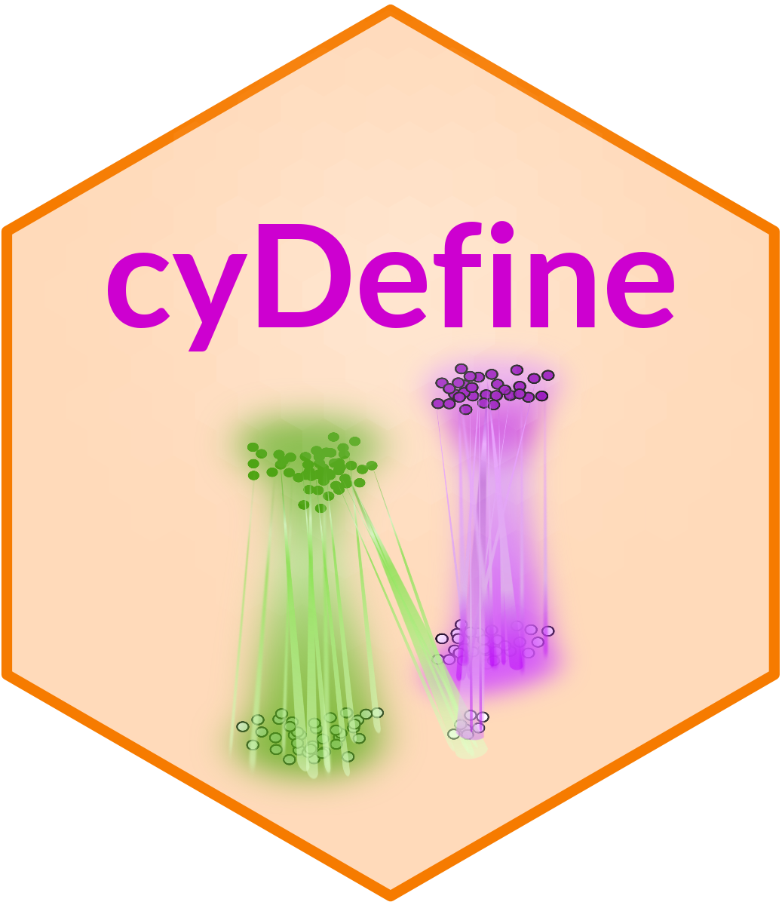
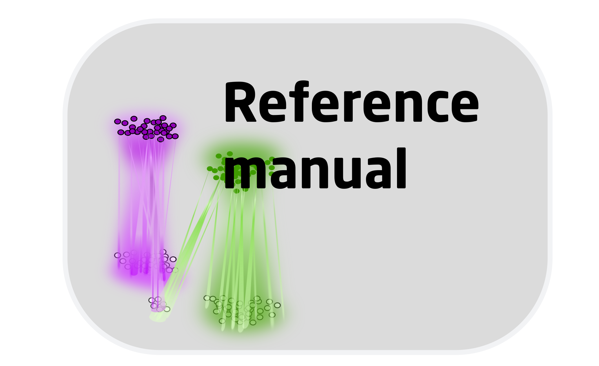
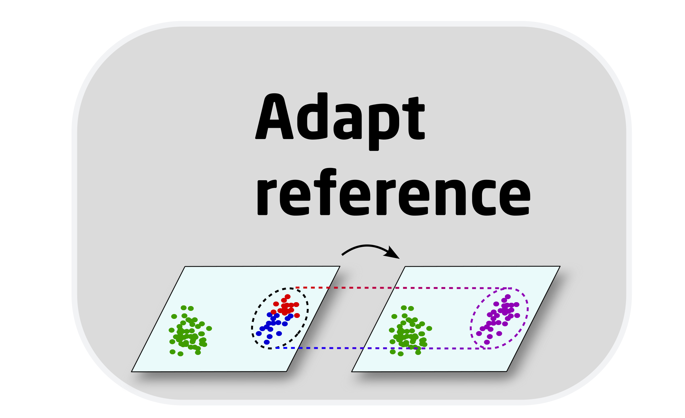
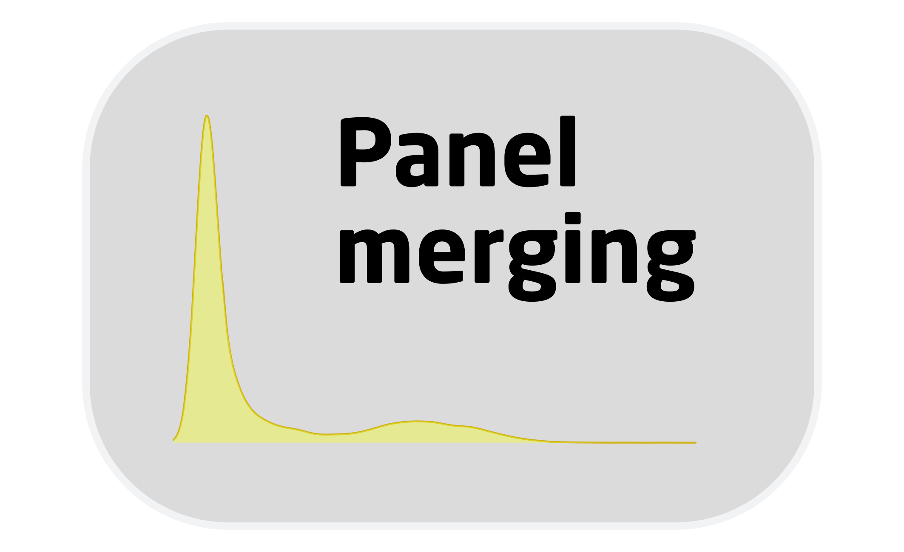

 

#### cyDefine enables reproducible cross-technology phenotype transfer in single-cell cytometry data

#### R Package on [GitHub](https://github.com/biosurf/cyDefine)

This page contains the vignettes demonstrating use cases and examples of phenotype transfer with `cyDefine`. The article introducing `cyDefine` is in prep.

If you have any issues or questions regarding the use of cyDefine, please do not hesitate to raise an issue on GitHub. In this way, others may also benefit from the answers and discussions.

 
 
<table style="width:100%">
<tr>

<td>
[{ width=75% }](cyDefine_ref_manual.html) Reference manual
</td>

<td>
[{ width=75% }](cyDefine_adapting_reference.html) Reference adaptation
</td>

</tr>
</table>
 

<table style="width:100%">
<tr>

<td>
[{ width=75% }](cyDefine_pregating.html) Vignette for pregating analysis
</td>
    
<!-- <td>
[{ width=75% }](cyCombine_panel_merging.html) Vignette for panel merging module
</td> -->

</tr>
</table>
 