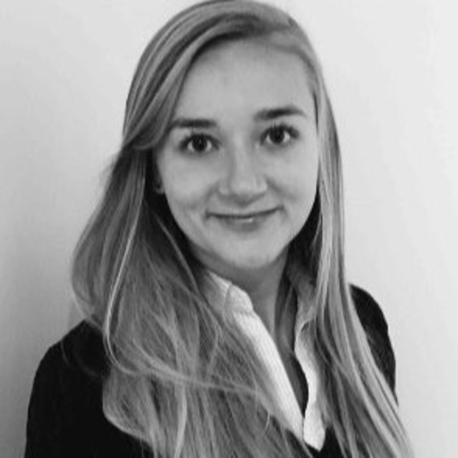

<!-- Add icon library -->
<!-- <link rel="stylesheet" href="https://cdnjs.cloudflare.com/ajax/libs/font-awesome/4.7.0/css/font-awesome.min.css"> -->

 

  

|            |   |                                    |
|------------|---|------------------------------------------------------------------------------------------------|
|{width=150px}    |   | **Lars Rønn Olsen** Group Leader, Associate Professor, PhD DTU Health Tech & Center for Genomic Medicine, Rigshospitalet                   |
|{width=150px}    |   | **Benito Campos** Adjunct Associate Professor, MD, MBA DTU Health Tech & Heidelberg University Hospital             |
|{width=150px}    |   | **Kristoffer Vitting-Seerup**       Assistant Professor, PhD DTU Health Tech                             |
|{width=150px}    |   | **Camilla Koldbæk Lemvigh**       PhD student DTU Health Tech & Dana-Farber Cancer Institute                              |
|{width=150px} |   | **Giorgia Moranzoni**       PhD student DTU Health Tech          |
|{width=150px} |   | **Nanna Møller Barnkob**       PhD student Symphogen A/S & DTU Health Tech   |
|{width=150px}    |   | **Panagiotis Mantas**        PhD student DTU Health Tech   |
|{width=150px} |   | **Søren Helweg Dam**       PhD student DTU Health Tech          |

   

# Collaborators
|            |   |                                    |
|------------|---|------------------------------------------------------------------------------------------------|
|{width=150px}    |   | **Center for Genomic Medicine, Rigshospitalet** **Center for Cancer Immune Therapy, Herlev Hospital**   |
|{width=150px}    |   | **Wu Lab, Dana-Farber Cancer Institute**      |
|  {width=150px}      |   | **The Clinical Immunology Research Unit, University of Southern Denmark**  |
|{width=150px}    |   | **Human Immune Monitoring Center, Stanford Univeristy**  |

   

# Alumni

|            |   |                                    |
|------------|---|------------------------------------------------------------------------------------------------|
|{width=150px}    |   | **Christina Bligaard Pedersen**   PhD student, 2019-2021   Postdoc, 2022          |

   
