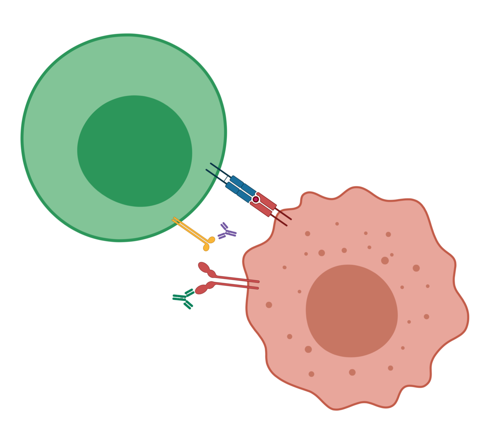
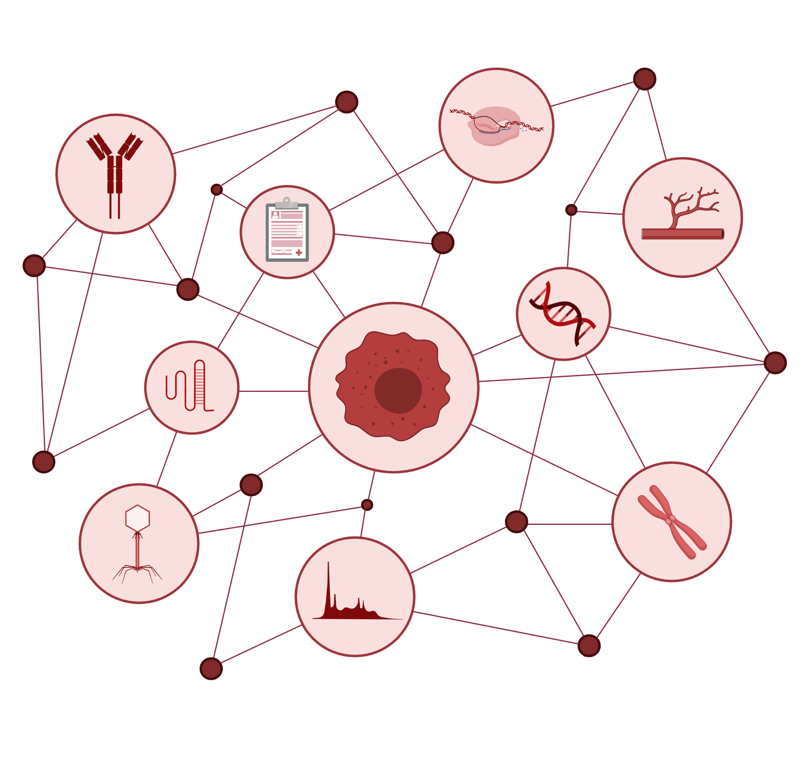
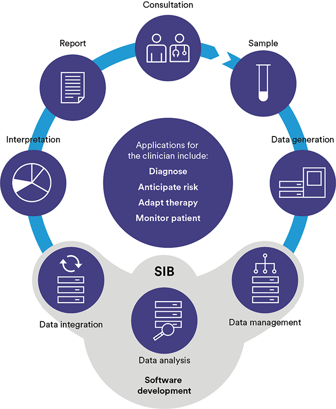

@ [Section for Bioinformatics](https://www.healthtech.dtu.dk/english/research/digital-health-and-biological-modelling/section-bioinformatics) | [Department of Health Technology](https://www.healthtech.dtu.dk) | [Technical University of Denmark](https://www.dtu.dk)

 

## Research profile

We are a bioinformatics outfit working on various aspects of data analysis related to cancer research. We collaborate with clinicians on prognostics, diagnostics, and therapeutics of cancer through our three pillars of research.

  

<table style="width:100%">
<col width="20%">
<col width="80%">
<tr>

<td>
 
Made in ©BioRender - biorender.com
</td>

<td>
### Single cell immune oncology
Immunotherapy is gradually becoming an integrated part of routine treatment for certain types of cancer including metastatic melanoma and non-small cell lung cancer. However, for many cancer types, it has yet to be discovered if some patients might benefit from treatment with immunotherapy.    Through the use of high-throughput single-cell platforms including mass cytometry and single-cell RNA sequencing, we aim to survey the interaction taking place between the cancer and tumor cells in unprecedented detail. Specifically, we are interested in changes that occur within immune cell populations upon disease onset or during a treatment course, and changes in cancer cells that make them less susceptible to immune destruction. Hopefully, this deeper understanding of within-tumor cellular interactions, can lead to novel treatment strategies and better patient stratification.
</td>

</tr>
</table>

   

<table style="width:100%">
<col width="80%">
<col width="20%">
<tr>

<td>
### Integrative Omics and Systems Biology
With the advent of many new technologies for analysis of biological material, new challenges arise for data analysists. Particularly, we are interested in how to combine the knowledge from multiple types of data into a single output, to learn even more about the underlying biology. Additionally, these novel methodologies make it possible to study not just one feature, but the interaction of multiple, and proper studies of cells or proteins require us to view them as part of a system rather than separate entities.    By utilizing protein-protein interaction networks, we can gain insights on cellular communication, and by working with gene ontologies it is possible to understand changes in gene expression not at a per-gene basis, but instead as parts of biologically relevant pathways.
</td>

<td>

Made in ©BioRender - biorender.com

</td>

</tr>
</table>

   

<table style="width:100%">
<col width="20%">
<col width="80%">
<tr>

<td>

Made in ©BioRender - biorender.com
</td>

<td>
### Clinical Bioinformatics
Today's routine clinical practice for many genetic diseases relies heavily on the analysis of high-throughput data including DNA microarrays as well as DNA and RNA sequencing. In order to analyze these data, development and maintenance of computational pipelines is pivotal, and for some patients, analyses which are not part of standard flow can also be required to determine the optimal treatment scheme.    In close collaboration with clinical partners, we work on developing novel approaches for analysis and handling of these data types. Examples include inter-platform conversion of a breast cancer subtyping scheme and determination of cancer type through comparison of routine samples to a large cohort of publicly available data.
</td>

</tr>
</table>

 